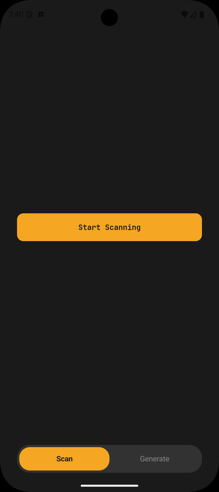
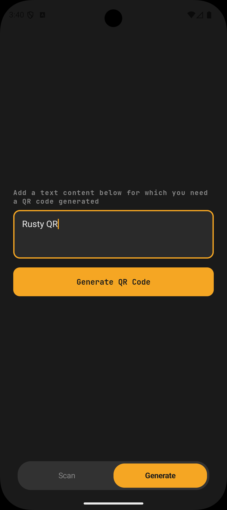
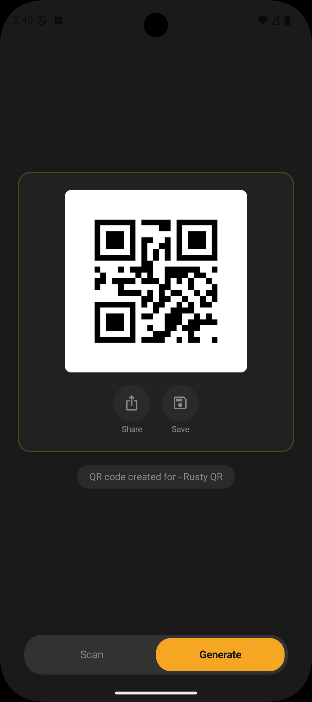
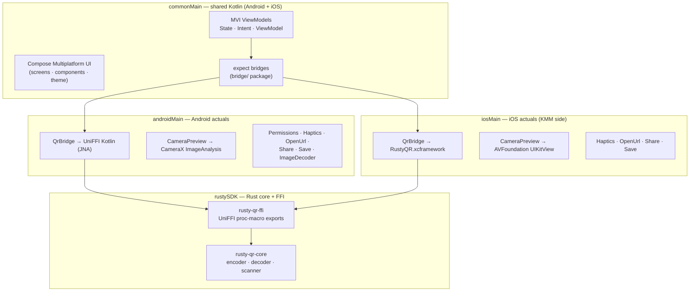
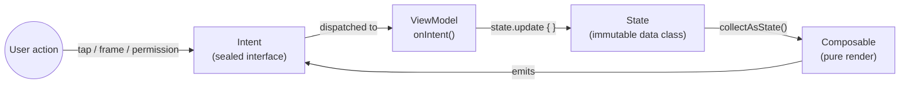
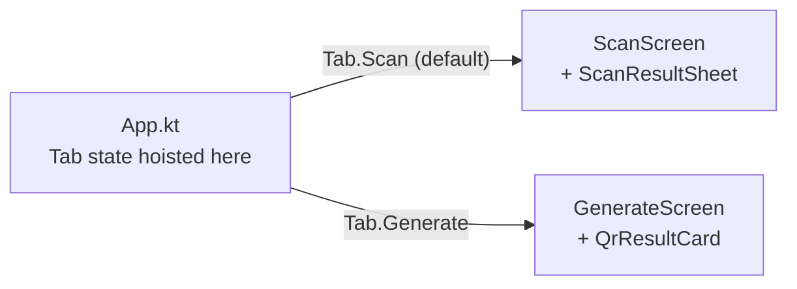

<div align="center">

# Rusty-QR

### QR Scanner/Generator app for Android and iOS - powered by a Rust based logic for encoding/decoding

<p>
  
  
  
  
  
  
  
</p>

<p><b>One Rust core · Two native apps</b></p>

<sub>QR generation and live camera scanning. <code>rusty-qr-core</code> crate handles every byte of QR logic; auto-generated Kotlin and Swift bindings wire it to a single Compose Multiplatform UI that renders identically on both platforms.</sub>

<br/><br/>

<a href="docs/ARCHITECTURE.md"><b>Deep dive: how Rust core powers the two apps' functionality →</b></a>
<br/><sub>Full build pipeline in <a href="docs/ARCHITECTURE.md"><code>docs/ARCHITECTURE.md</code></a></sub>

</div>

---

## Screenshots

<div align="center">

<table>
  <tr>
    <td align="center" width="33%">
      
      <br/><sub><b>Scaning Screen</b><br/>Camera cold until the user taps Start Scanning. No battery/CPU cost on tab open.</sub>
    </td>
    <td align="center" width="33%">
      
      <br/><sub><b>Generate Screen — Input</b><br/>Enter any text; Rust encoder renders a PNG in real time.</sub>
    </td>
    <td align="center" width="33%">
      
      <br/><sub><b>Generate Screen — Result</b><br/>Share-sheet export and save-to-gallery wired through platform bridges.</sub>
    </td>
  </tr>
</table>

<sub>Android · Material 3 dark theme · captured on Pixel-class device</sub>

</div>

---

## What does the project do

Mobile teams writing cross-platform features often maintain the same logic in two languages. This
leads to subtle behavioural drift, double the bug surface, and double the maintenance burden.
Rusty-QR demonstrates a different approach: **write the low-level logic once in Rust, compile to
native binaries, and auto-generate idiomatic Kotlin and Swift bindings** via Mozilla's UniFFI.

The result is a single source of truth for QR encoding and decoding that both platforms share, with
native performance, compile-time memory safety, and a single Compose UI rendered identically on
both platforms.

---

## Features

### QR Code Generation

Enter text, get a PNG rendered in real time. The Rust encoder supports four error
correction levels (Low, Medium, Quartile, High) trading density for damage resilience. Result card
offers share-sheet export and save-to-gallery.

### QR Code Scanning (Saved Images) - on Roadmap for v1.1

Decode QR codes from PNG or JPEG bytes picked from the photo library. Both platforms share the same
Rust decode path.

### Live Camera Scanning

Live camera scanner decodes QR codes from the device camera feed. Camera frames are passed directly
to Rust as raw grayscale (Y-plane) buffers — no image encoding overhead — enabling sub-20ms decode
latency per frame. The Scan tab opens in an **idle** state — no camera feed, no permission prompt —
with a centered **Start Scanning** button. Tapping the button requests camera permission (first time)
or re-checks status, then activates the preview and frame analyzer. A scan gate (atomic-style flag)
prevents double-fire on successful decode.

### Scan Result Sheet

A successful decode surfaces a `ModalBottomSheet` with the decoded content, a content-type badge
(URL vs TEXT), and actions: **Open in Browser** (for URLs), **Copy** to clipboard, and **Scan
Again**. Dismissing the sheet (swipe or Scan Again) returns the screen to idle so the camera stays
cold until the user explicitly taps Start Scanning again — no background battery/CPU cost.

### Localization

UI ships in **three languages**: English (default), French (Canada), and Spanish. Strings live in
Compose Multiplatform resource bundles under `composeApp/src/commonMain/composeResources/`
(`values/`, `values-fr-rCA/`, `values-es/`) and are shared by Android and iOS from a single source.
ViewModels emit `UiText` (sealed type wrapping either a raw string or a `StringResource`) so locale
resolution stays in the composable layer and user-facing copy is never hardcoded in business logic.

### Shared Compose UI

Every screen — scan, generate, result sheet — is Compose Multiplatform and lives in `commonMain`.
The iOS app hosts this Compose UI inside a single `UIViewControllerRepresentable` wrapper. No
duplicate SwiftUI screens; the only platform-specific code is the hardware bridges (camera,
clipboard, haptics, share sheet, URL open).

---

<details>
<summary><b>Architecture</b> — shared commonMain, thin platform bridges, single Rust core</summary>

<br/>



All business logic and UI live in `commonMain`. Platform code is minimal — only what the OS
requires (camera hardware, file I/O, haptics, system share sheet, clipboard, URL open).

| Layer     | Technology                          | Responsibility                                              |
|-----------|-------------------------------------|-------------------------------------------------------------|
| UI        | Compose Multiplatform (both)        | Renders state, dispatches intents                           |
| ViewModel | Kotlin (commonMain)                 | Processes intents, owns state, manages the scan gate        |
| Bridge    | expect/actual (`bridge/` package)   | Abstracts platform-specific FFI / hardware calls            |
| FFI       | UniFFI (auto-generated)             | Marshals types between Kotlin/Swift and Rust                |
| Core      | Rust                                | All QR encoding, decoding, validation, and error handling   |

</details>

<details>
<summary><b>MVI Pattern</b> — State · Intent · ViewModel with strict unidirectional flow</summary>

<br/>

Every screen follows **Model–View–Intent** with strict unidirectional data flow:



Rules enforced across every screen:

- **State** is an immutable `data class` — no `var` exposed to composables.
- **Intent** is a `sealed interface` — every user action is an explicit type, not a lambda callback.
- **ViewModel** owns all business logic — composables are pure render functions.
- **Side effects** (haptics, URL open, share, save) are triggered inside `onIntent()`, never inside
  a composable body.
- **Error contract**: ArrowKT `Either<QrError, T>` — never throw for domain errors, never
  `kotlin.Result<T>`.
- **Explicit backing fields** (KEEP-278): `val state: StateFlow<X> field = MutableStateFlow(...)`
  rather than `_state` / `asStateFlow()`.

</details>

<details>
<summary><b>expect/actual Convention</b> — all platform contracts in one <code>bridge/</code> package</summary>

<br/>

All platform-specific contracts live in a single `bridge/` package — never scattered across feature
packages:

```
commonMain/kotlin/com/p2/apps/rustyqr/bridge/
├── QrBridge.kt             // Rust FFI — generate/decode/version
├── CameraPreview.kt        // camera composable
├── CameraPermission.kt     // runtime permission check + request
├── HapticFeedback.kt       // tap/success haptic
├── OpenUrl.kt              // open http(s) URL in system browser
├── ShareQrImage.kt         // system share sheet for PNG bytes
├── SaveQrImage.kt          // save PNG to gallery / Photos
└── ImageDecoder.kt         // PNG bytes → ImageBitmap
```

Each has a matching `*.android.kt` and `*.ios.kt` actual. The `MatchingDeclarationName` detekt rule
is disabled because actual files follow the `*.android.kt` / `*.ios.kt` naming convention rather
than matching the top-level class name.

</details>

<details>
<summary><b>Navigation</b> — two tabs, crossfade, no nav library</summary>

<br/>

No navigation library. Two top-level tabs with `Crossfade`. The scan result is a `ModalBottomSheet`
driven by `ScanViewModel` state, not a navigation destination.



Camera lifecycle is gated on both tab visibility and an explicit user action. `CameraPreview` is
composed only when `Tab.Scan` is active **and** the user has tapped Start Scanning. Switching tabs
or dismissing the result sheet returns the screen to idle and unbinds the camera.

</details>

<details>
<summary><b>Theme, Typography, Motion</b> — Material 3 dark, amber primary, MD3 easing</summary>

<br/>

Dark-only Material 3 colour scheme. Feature code accesses colours only through
`MaterialTheme.colorScheme.*` — never direct imports from `Color.kt`.

| Token                 | Value                                    |
|-----------------------|------------------------------------------|
| Primary               | `#F5A623` (amber)                        |
| Background            | `#1A1A1A`                                |
| Surface / Container   | `#1E1E1E` / `#242424`                    |
| Outline               | `#3A3A3A`                                |
| Body font             | Inter                                    |
| Display / mono font   | JetBrains Mono (titles, badges, buttons) |
| Shape scale           | 4 / 8 / 12 / 16 / 28dp (MD3)             |

Motion uses MD3 easing curves from `ui/theme/Motion.kt`:

- `StandardEasing` — tab crossfade, colour animations
- `EmphasizedDecelerate` — elements entering (QR card appear)
- `EmphasizedAccelerate` — elements leaving (input text animates down)

</details>

<details>
<summary><b>Project Structure</b> — module layout across Kotlin, Swift, and Rust</summary>

<br/>

```
Rusty-QR/
├── composeApp/                 # KMP module — shared UI + Android actuals + iOS actuals
│   ├── src/commonMain/         # Shared Kotlin: UI, ViewModels, bridges (expect)
│   ├── src/androidMain/        # Android actuals + CameraX + JNI libs + generated UniFFI
│   └── src/iosMain/            # iOS actuals (Kotlin/Native)
│   └── README.md               # Android build pipeline + androidMain details
│
├── iosApp/                     # iOS Xcode project — hosts Compose UI via UIKit
│   ├── project.yml             # XcodeGen source of truth
│   ├── iosApp/                 # Swift shell (ContentView wraps MainViewController)
│   ├── Configuration/          # xcconfig files
│   ├── generated/              # UniFFI Swift bindings (gitignored)
│   ├── Frameworks/             # RustyQR.xcframework (gitignored)
│   └── README.md               # iOS build pipeline + Xcode/XcodeGen details
│
├── rustySDK/                   # Rust workspace — all QR logic
│   ├── crates/core/            # encoder · decoder · types · errors (no FFI)
│   ├── crates/ffi/             # UniFFI thin wrappers
│   ├── crates/uniffi-bindgen/  # CLI for generating Kotlin/Swift bindings
│   └── README.md               # Rust SDK deep dive (ownership, cargo, FFI types)
│
├── config/detekt/              # Detekt static analysis rules
├── docs/                       # PRD, implementation plan, ADRs
└── .husky/                     # Git hooks (pre-commit lint, commit-msg format)
```

For per-module details, see the nested READMEs linked above.

</details>

<details>
<summary><b>Build and Run</b> — prerequisites and Gradle entry points</summary>

<br/>

### Prerequisites

- **Android**: Android Studio, JDK 11+, Android SDK (compileSdk 36, minSdk 29)
- **iOS**: Xcode, macOS, XcodeGen (`brew install xcodegen`)
- **Rust**: Install via [rustup.rs](https://rustup.rs/) — targets for Android + iOS cross-compile
  (see platform READMEs for first-time setup)

### Quick commands

```bash
# Android — build Rust .so + Kotlin bindings + APK
./gradlew :composeApp:buildRustAndroid :composeApp:assembleDebug

# iOS — build Rust .a + XCFramework + Swift bindings + Xcode project
./gradlew :composeApp:buildRustIos
open iosApp/iosApp.xcodeproj

# All three Kotlin/Swift linters
./gradlew :composeApp:lintAll

# Auto-fix Kotlin formatting
./gradlew :composeApp:ktlintFormat
```

Deeper details (what each task does, how the cross-compiler is invoked, how UniFFI generates
bindings) live in the platform READMEs —
see [`composeApp/src/androidMain/README.md`](composeApp/src/androidMain/README.md) for the Android
pipeline and [`iosApp/README.md`](iosApp/README.md) for the iOS pipeline. Shared KMP conventions
(MVI, `bridge/` expect/actual, source-set layout) are covered in
[`composeApp/README.md`](composeApp/README.md).

### Rust SDK (standalone)

```bash
cd rustySDK
cargo test --workspace                           # all tests
cargo clippy --workspace -- -D warnings          # lint
cargo bench -p rusty-qr-core                     # benchmarks
cargo deny check                                 # supply chain audit
```

See [`rustySDK/README.md`](rustySDK/README.md) for the full Rust deep dive.

</details>

<details>
<summary><b>Tech Stack</b> — versions and libraries at a glance</summary>

<br/>

| Component        | Technology                         | Version       |
|------------------|------------------------------------|---------------|
| Shared UI        | Compose Multiplatform              | 1.11.0-beta01 |
| Shared logic     | Kotlin Multiplatform               | 2.3.20        |
| Error handling   | ArrowKT `Either`                   | —             |
| Android camera   | CameraX                            | —             |
| iOS camera       | AVFoundation                       | —             |
| FFI loader       | JNA (Android)                      | 5.14.0        |
| QR engine        | Rust (edition 2021)                | —             |
| QR encoding      | `qrcode` crate                     | 0.14          |
| QR decoding      | `rqrr` crate                       | 0.10          |
| Image processing | `image` crate                      | 0.25          |
| FFI bindings     | UniFFI                             | 0.28          |
| Rust errors      | `thiserror`                        | 2.x           |
| Kotlin lint      | ktlint + detekt                    | —             |
| Swift lint       | SwiftLint                          | —             |
| Git hooks        | Husky-style (Gradle task)          | —             |
| Xcode project    | XcodeGen                           | —             |
| Dependency audit | `cargo-deny`                       | —             |

</details>

<details>
<summary><b>Code Quality</b> — formatters, linters, hooks, CI</summary>

<br/>

| Check                  | Tool            | Command                                                                        |
|------------------------|-----------------|--------------------------------------------------------------------------------|
| Rust formatting        | `rustfmt`       | `cargo fmt --check`                                                            |
| Rust linting           | Clippy          | `cargo clippy --workspace -- -D warnings`                                      |
| Rust tests             | Cargo test      | `cargo test --workspace`                                                       |
| Rust benchmarks        | Criterion       | `cargo bench -p rusty-qr-core`                                                 |
| Rust supply chain      | cargo-deny      | `cargo deny check`                                                             |
| Kotlin formatting      | ktlint          | `./gradlew :composeApp:ktlintCheck`                                            |
| Kotlin static analysis | detekt          | `./gradlew :composeApp:detekt`                                                 |
| Swift linting          | SwiftLint       | `./gradlew :composeApp:swiftlint`                                              |
| Pre-commit hook        | Husky           | `lintAll` on staged `.kt`/`.kts`/`.swift`; `cargo fmt --check` on staged `.rs` |
| Commit messages        | commit-msg hook | Enforces conventional commits (`type(scope): message`)                         |
| iOS CI                 | GitHub Actions  | Rust checks + XCFramework build + xcodebuild + SwiftLint                       |

</details>

---

## License

Released under the [MIT License](LICENSE). Portfolio project — not published to crates.io, Maven
Central, or CocoaPods.
