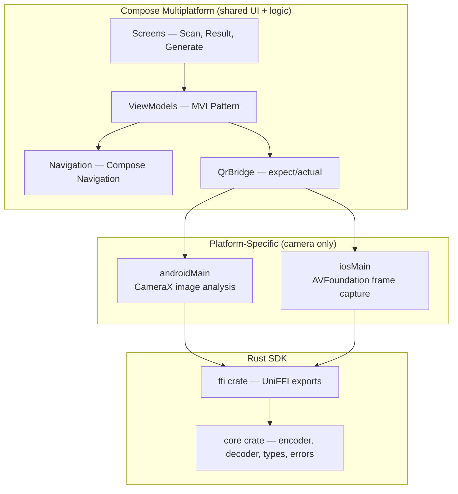

# Rusty-QR

A cross-platform QR code generation and live scanning app built with **Kotlin Multiplatform**, *
*Compose Multiplatform**, and a **Rust** core library. One Rust codebase handles all QR logic;
auto-generated Kotlin and Swift bindings connect it to Android and iOS with zero manual bridging
code.

```
┌─────────────────────────────────────────────────────────┐
│                     Rusty-QR App                        │
│                                                         │
│        Compose Multiplatform UI (shared)                │
│            Android + iOS from one codebase              │
│                     │                                   │
│              QrBridge (expect/actual)                    │
│                     │                                   │
│         ┌───── FFI Boundary ──────┐                     │
│         │  Kotlin Bindings (JNA)  │  Swift Bindings     │
│         └─────────────────────────┘                     │
│                     │                                   │
│            Rust SDK (rusty-qr)                          │
│         Encode · Decode · Scan                          │
└─────────────────────────────────────────────────────────┘
```

---

## Why This Project Exists

Mobile teams writing cross-platform features often maintain the same logic in two languages. This
leads to subtle behavioural drift, double the bug surface, and double the maintenance burden.
Rusty-QR demonstrates a different approach: **write the business logic once in Rust, compile to
native binaries, and auto-generate idiomatic Kotlin and Swift bindings** via Mozilla's UniFFI.

The result is a single source of truth for QR encoding and decoding that both platforms share, with
native performance and compile-time memory safety.

---

## Features

### QR Code Generation

The app generates QR codes from any text input and displays the result as an image. Users enter
text, choose an output size, and receive a PNG rendered in real time. The Rust encoder supports four
error correction levels (Low, Medium, Quartile, High) so users can trade QR code density for damage
resilience.

### QR Code Scanning (Saved Images)

Users can decode QR codes from saved images in their photo library. The app accepts PNG and JPEG
images, passes the bytes to the Rust decoder, and displays the decoded content. This works on both
platforms through the same shared decode path.

### Live Camera Scanning

The app provides a live camera scanner that decodes QR codes from the device camera feed in real
time. The camera preview and scan UI are built with Compose Multiplatform, while the
platform-specific camera access uses CameraX (Android) and AVFoundation (iOS) under the hood. Camera
frames are passed directly to Rust as raw grayscale pixel buffers — no image encoding/decoding
overhead — enabling sub-20ms decode latency per frame.

When a QR code is detected, the app navigates to a result screen showing the decoded content with
options to open URLs in the browser, copy text to the clipboard, or scan again.

### Scan-to-Result Navigation

Successful scans trigger a navigation flow from the camera screen to a result screen. A scan gate (
atomic lock) prevents double-navigation on rapid successive decodes. The camera session stays alive
during navigation — no black flash when returning to scan again.

### Cross-Platform Shared UI

All screens — generation, scanning, and results — are built with Compose Multiplatform, sharing UI
code across Android and iOS from a single Kotlin codebase. Platform-specific code is limited to
camera hardware access (CameraX on Android, AVFoundation on iOS) and the FFI bridge layer. The iOS
app hosts the Compose UI via a `UIViewControllerRepresentable` wrapper.

---

## Architecture



The project follows the **MVI (Model-View-Intent)** pattern on the mobile side and the *
*Command-Response** pattern on the Rust side. Both patterns share the same philosophy:
unidirectional data flow with no hidden state.

| Layer     | Technology                             | Responsibility                                            |
|-----------|----------------------------------------|-----------------------------------------------------------|
| UI        | Compose Multiplatform (both platforms) | Renders state, dispatches intents                         |
| ViewModel | Kotlin (commonMain)                    | Processes intents, manages state, emits navigation events |
| Bridge    | expect/actual (KMM)                    | Abstracts the platform-specific FFI call                  |
| FFI       | UniFFI (auto-generated)                | Marshals types between Kotlin/Swift and Rust              |
| Core      | Rust                                   | All QR encoding, decoding, validation, and error handling |

---

## Project Structure

```
Rusty-QR/
├── composeApp/
│   ├── src/commonMain/       # Shared Kotlin — UI, ViewModels, navigation
│   ├── src/androidMain/      # Android — CameraX, QrBridge actual, MainActivity
│   └── src/iosMain/          # iOS — QrBridge actual (KMM side)
│
├── iosApp/                   # Swift entry point (hosts Compose UI via UIViewController)
│
├── rustySDK/                  # Rust workspace (all QR logic lives here)
│   ├── crates/core/          # Business logic — encoder, decoder, types, errors
│   ├── crates/ffi/           # UniFFI wrapper — thin one-liner delegations
│   └── crates/uniffi-bindgen/ # CLI tool for generating Kotlin/Swift bindings
│
├── config/detekt/            # Detekt static analysis rules
├── docs/                     # PRD, implementation plan, ADRs
└── .husky/                   # Git hooks (pre-commit lint, commit-msg format)
```

---

## The Rust SDK

The Rust SDK is the core of this project — a pure-Rust library that handles all QR code generation
and scanning. It compiles to native `.so` (Android) and `.a` (iOS) binaries, with Kotlin and Swift
bindings auto-generated by UniFFI.

**Key stats:**

| Metric                   | Value                                                         |
|--------------------------|---------------------------------------------------------------|
| Public API surface       | 5 functions, 4 types                                          |
| Test coverage            | 56 tests (unit, integration, FFI, thread safety, determinism) |
| Generate 256px QR        | ~1.1 ms                                                       |
| Decode from camera frame | ~2.2 ms                                                       |
| Zero panics              | All errors returned as typed `Result<T, QrError>`             |
| Dependencies             | Feature-gated, audited via `cargo-deny`                       |

The SDK is structured as two crates: **core** (all logic, no FFI dependency) and **ffi** (thin
UniFFI wrappers, zero business logic). This separation means the core logic compiles and tests on
any platform — no mobile toolchain required.

For a deep dive into the Rust implementation, Rust language concepts, Cargo commands, code flow
diagrams, and architecture details, see the **[Rust SDK README](rustySDK/README.md)**.

---

## Build and Run

### Prerequisites

- **Android**: Android Studio, JDK 11+, Android SDK (compileSdk 36, minSdk 29)
- **iOS**: Xcode, macOS
- **Rust**: Install via [rustup.rs](https://rustup.rs/) (edition 2021)

### Android

```bash
# Build the Rust native libraries for Android targets
cd rustySDK && cargo build -p rusty-qr-ffi --release --target aarch64-linux-android
cd rustySDK && cargo build -p rusty-qr-ffi --release --target x86_64-linux-android

# Generate Kotlin bindings
cd rustySDK && cargo run -p uniffi-bindgen generate \
  --library target/aarch64-linux-android/release/librusty_qr_ffi.so \
  --language kotlin --out-dir ../composeApp/src/androidMain/kotlin/generated

# Format the generated Kotlin file (UniFFI skips auto-format if ktlint CLI is not installed)
./gradlew :composeApp:ktlintFormat

# Build and install the Android app
./gradlew :composeApp:assembleDebug
```

### iOS

```bash
# Build the Rust native library for iOS (static archive)
cd rustySDK && cargo build -p rusty-qr-ffi --release --target aarch64-apple-ios

# Generate Swift bindings
cd rustySDK && cargo run -p uniffi-bindgen generate \
  --library target/aarch64-apple-ios/release/librusty_qr_ffi.a \
  --language swift --out-dir ../iosApp/generated

# Open in Xcode and run
open iosApp/iosApp.xcodeproj
```

### Rust SDK (standalone)

```bash
cd rustySDK

# Run all tests
cargo test --workspace

# Run linter
cargo clippy --workspace -- -D warnings

# Run benchmarks
cargo bench -p rusty-qr-core

# Audit dependencies
cargo deny check
```

### Kotlin/Swift Linting

```bash
# All three linters (ktlint, detekt, swiftlint)
./gradlew :composeApp:lintAll

# Auto-fix Kotlin formatting
./gradlew :composeApp:ktlintFormat
```

---

## Tech Stack

| Component        | Technology                         | Version       |
|------------------|------------------------------------|---------------|
| Shared UI        | Compose Multiplatform              | 1.11.0-beta01 |
| Shared logic     | Kotlin Multiplatform               | 2.3.20        |
| Android camera   | CameraX (platform-specific)        | —             |
| iOS camera       | AVFoundation (platform-specific)   | —             |
| Navigation       | Compose Navigation (multiplatform) | 2.9.0-alpha01 |
| QR engine        | Rust (edition 2021)                | —             |
| QR encoding      | `qrcode` crate                     | 0.14          |
| QR decoding      | `rqrr` crate                       | 0.10          |
| Image processing | `image` crate                      | 0.25          |
| FFI bindings     | UniFFI                             | 0.28          |
| Error handling   | `thiserror`                        | 2.x           |
| Kotlin lint      | ktlint + detekt                    | —             |
| Swift lint       | SwiftLint                          | —             |
| Git hooks        | Husky-style (Gradle task)          | —             |
| Dependency audit | `cargo-deny`                       | —             |

---

## Code Quality

| Check                  | Tool            | Command                                                |
|------------------------|-----------------|--------------------------------------------------------|
| Rust formatting        | `rustfmt`       | `cargo fmt --check`                                    |
| Rust linting           | Clippy          | `cargo clippy --workspace -- -D warnings`              |
| Rust tests             | Cargo test      | `cargo test --workspace`                               |
| Rust benchmarks        | Criterion       | `cargo bench -p rusty-qr-core`                         |
| Rust supply chain      | cargo-deny      | `cargo deny check`                                     |
| Kotlin formatting      | ktlint          | `./gradlew :composeApp:ktlintCheck`                    |
| Kotlin static analysis | detekt          | `./gradlew :composeApp:detekt`                         |
| Swift linting          | SwiftLint       | `./gradlew :composeApp:swiftlint`                      |
| Pre-commit hook        | Husky           | `lintAll` on staged `.kt`/`.kts`/`.swift`; `cargo fmt --check` on staged `.rs` |
| Commit messages        | commit-msg hook | Enforces conventional commits (`type(scope): message`) |

---

## License

This is a portfolio project. Not published to crates.io, Maven Central, or CocoaPods.
