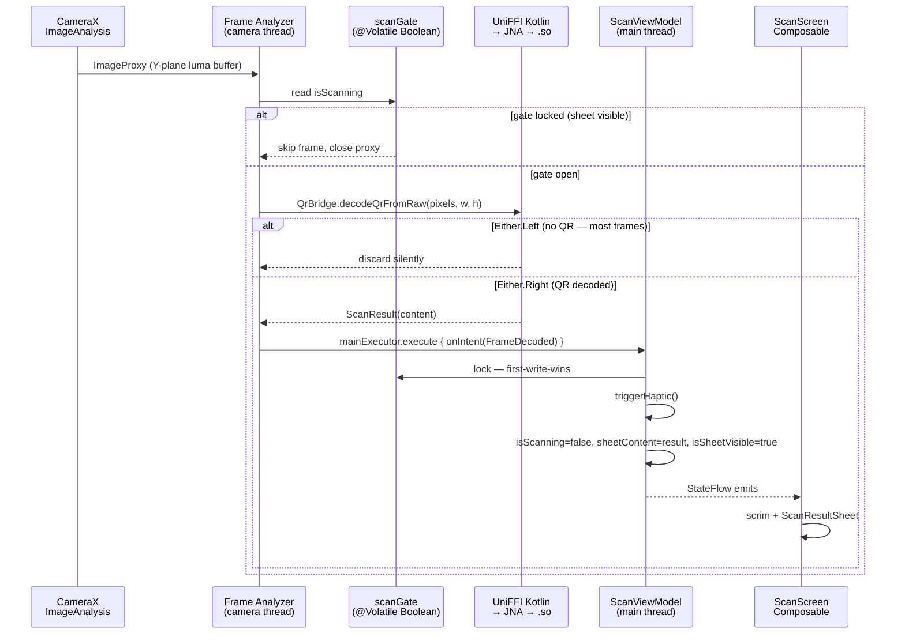
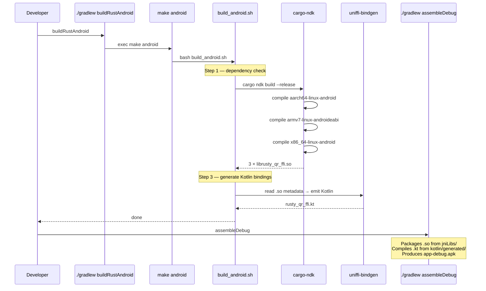
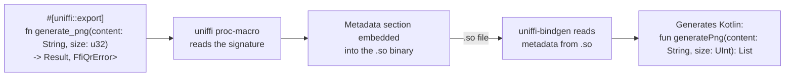

# composeApp — KMP Module (Android Focus)

This module is the Kotlin Multiplatform target that contains the shared Compose UI (`commonMain`),
the Android actuals (`androidMain`), and the iOS Kotlin/Native actuals (`iosMain`). This document
focuses on the **Android side**: how Rust gets compiled into the APK, how the Android actuals wire
up to CameraX and UniFFI-generated Kotlin bindings, and the Android-specific Gradle tasks.

For the cross-platform app architecture, MVI pattern, shared UI, and theme, see the
[top-level README](../README.md). For the iOS side, see [`iosApp/README.md`](../iosApp/README.md).
For the Rust engine itself, see [`rustySDK/README.md`](../rustySDK/README.md).

---

## Android Source Set Layout

```
composeApp/src/androidMain/
├── kotlin/com/p2/apps/rustyqr/
│   ├── MainActivity.kt                 # Single-activity host — sets Compose content + MainActivityHolder
│   ├── MainActivityHolder.kt           # Weak-ref holder so bridges reach the foreground Activity
│   ├── RustyQrApplication.kt           # Application subclass — seeds AppContextHolder
│   ├── AppContextHolder.kt             # Static Application context for bridges (permissions, share, save)
│   ├── Platform.android.kt             # Platform() actual
│   └── bridge/
│       ├── QrBridge.android.kt         # actual — delegates to UniFFI-generated Kotlin
│       ├── CameraPreview.android.kt    # actual — CameraX PreviewView + ImageAnalysis
│       ├── CameraPermission.android.kt # actual — ActivityResultLauncher
│       ├── HapticFeedback.android.kt   # actual — HapticFeedbackType via View
│       ├── OpenUrl.android.kt          # actual — Intent(ACTION_VIEW)
│       ├── ShareQrImage.android.kt     # actual — Intent(ACTION_SEND) via FileProvider
│       ├── SaveQrImage.android.kt      # actual — MediaStore.Images
│       └── ImageDecoder.android.kt     # actual — BitmapFactory → ImageBitmap
│
├── kotlin/generated/                   # GENERATED by UniFFI (do not edit) — gitignored
│   └── com/p2/apps/rustyqr/rust/rusty_qr_ffi.kt
│
├── jniLibs/                            # GENERATED by cargo-ndk — gitignored
│   ├── arm64-v8a/librusty_qr_ffi.so
│   ├── armeabi-v7a/librusty_qr_ffi.so
│   └── x86_64/librusty_qr_ffi.so
│
├── res/xml/                            # FileProvider paths, adaptive icon, etc.
└── AndroidManifest.xml                 # Permissions, activity, application class
```

The Android app has no Compose screens of its own — it reuses the shared `commonMain` screens from
the KMP module. The only Android-specific Compose code is inside the `bridge/` actuals (e.g.
`AndroidView` wrapping `PreviewView`).

---

## Scan Feature — Data Flow on Android



Key design decisions on Android:

- **Gate is `@Volatile Boolean`**, not `AtomicBoolean` — fast read on camera thread, no lock
  overhead; writes only happen on the main thread.
- **Camera session stays bound** when `isScanning = false` — the analyzer just drops frames. Avoids
  the black flash that would happen if we unbound on decode and rebound on dismiss.
- **`Either.Left` frames are silently discarded** — most frames contain no QR; this is the expected
  case, not an error path.
- **JNA is the loader** — the generated `rusty_qr_ffi.kt` calls into `librusty_qr_ffi.so` through
  the `net.java.dev.jna` runtime library, not `System.loadLibrary`.

---

## Android Build: From Rust to APK

The QR code logic is written in **Rust**, but Android apps run Kotlin on ART. Kotlin can't call
Rust directly — they're different languages with different runtimes. Two things need to happen:

1. **A compiled Rust library** (`.so` file per CPU architecture) that Android loads at runtime
2. **Generated Kotlin code** that knows how to call the functions inside that library

The build pipeline automates both.

### Building the app

```bash
# Compile Rust + generate Kotlin bindings (only needed when Rust code changes)
./gradlew :composeApp:buildRustAndroid

# Build the Android APK (picks up .so + generated .kt automatically)
./gradlew :composeApp:assembleDebug

# Both in one line
./gradlew :composeApp:buildRustAndroid :composeApp:assembleDebug
```

If you're only editing Kotlin / UI, skip `buildRustAndroid` — `assembleDebug` reuses the existing
`.so` files and generated binding.

### What `buildRustAndroid` actually does

`buildRustAndroid` is a Gradle `Exec` task that invokes `make android` in `rustySDK/`. Developers
never run `make` directly — Gradle is the only entry point, so CI, local builds, and IDE sync all
take the same path.

```makefile
# rustySDK/Makefile (excerpt)
android:
    ./scripts/build_android.sh

clean:
    cargo clean
    rm -rf ../composeApp/src/androidMain/jniLibs
    rm -rf ../composeApp/src/androidMain/kotlin/generated
```

`build_android.sh` does three things in order:

**1. Dependency check.** Verifies `cargo-ndk`, `ANDROID_NDK_HOME`, and the three Android Rust
targets are installed. If anything is missing, it prints the exact install command.

**2. Cross-compile Rust.** `cargo-ndk` invokes the Rust compiler once per architecture:

| Architecture  | Who uses it                               | Output                                  |
|---------------|-------------------------------------------|-----------------------------------------|
| `arm64-v8a`   | All modern Android phones (64-bit ARM)    | `jniLibs/arm64-v8a/librusty_qr_ffi.so`  |
| `armeabi-v7a` | Older 32-bit ARM devices                  | `jniLibs/armeabi-v7a/librusty_qr_ffi.so`|
| `x86_64`      | Android emulator on a Mac                 | `jniLibs/x86_64/librusty_qr_ffi.so`     |

All `.so` files are built with **16KB ELF page alignment** (`align 2**14`), compliant with
[Android's 16KB page size requirement](https://developer.android.com/guide/practices/page-sizes)
effective November 2025. Handled automatically by NDK 28+ (we use NDK 30) — no extra linker flags.
AGP 9.1 handles zip alignment at packaging time.

**3. Generate Kotlin bindings.** `uniffi-bindgen` reads UniFFI metadata embedded in the `.so` and
emits a single `.kt` file:

```
Rust:    generate_png(content: &str, size: u32) -> Result<Vec<u8>, QrError>
         ↓  uniffi-bindgen generates  ↓
Kotlin:  fun generatePng(content: String, size: UInt): List<UByte>
         (throws FfiQrException on error)
```

Output lands at:

```
composeApp/src/androidMain/kotlin/generated/com/p2/apps/rustyqr/rust/rusty_qr_ffi.kt
```

### How Gradle picks up the artifacts

Gradle needs no special configuration — it uses **convention-based source directories**:

- **`jniLibs/`** is a magic directory name for the Android Gradle Plugin. Any `.so` files inside
  `jniLibs/<abi>/` are automatically packaged into the APK. At install time the device extracts
  only the `.so` matching its CPU.
- **`kotlin/`** under a source set is where Gradle looks for source files to compile. The generated
  `rusty_qr_ffi.kt` is compiled like any other Kotlin file.
- **JNA** (Java Native Access) is a runtime library declared in `build.gradle.kts` via the
  `androidMainImplementation` configuration (a KMP sourceSets DSL workaround). The generated
  Kotlin uses JNA to load `librusty_qr_ffi.so` and call its functions. Without JNA the generated
  code would compile but crash at runtime.

### Full pipeline



### Why three `.so` files but one `.kt` file?

**Three `.so` files** because each CPU architecture needs its own machine code. ARM code can't run
on x86 and vice versa.

**One `.kt` file** because the Kotlin code is architecture-independent — it calls Rust functions by
name (e.g. `generate_png`), and JNA resolves those names against whichever `.so` was loaded on the
device. The UniFFI metadata in all three `.so` files is identical, so any one of them can be used
as the source for binding generation.

---

## Android-Specific Gradle Tasks

| Task                                    | What it does                                               |
|-----------------------------------------|------------------------------------------------------------|
| `:composeApp:buildRustAndroid`          | `make android` — cross-compile + generate Kotlin bindings  |
| `:composeApp:assembleDebug`             | Standard Android debug APK build                           |
| `:composeApp:installDebug`              | Install debug APK to connected device / emulator           |
| `:composeApp:ktlintCheck` / `...Format` | Kotlin lint / auto-fix                                     |
| `:composeApp:detekt`                    | Static analysis (max line length 120, Android mode)        |
| `:composeApp:lintAll`                   | ktlint + detekt + SwiftLint (iOS side)                     |
| `:composeApp:installGitHooks`           | Install pre-commit + commit-msg hooks                      |

---

## First-Time Setup

```bash
# 1. Rust
curl --proto '=https' --tlsv1.2 -sSf https://sh.rustup.rs | sh

# 2. Android cross-compilation targets
rustup target add aarch64-linux-android armv7-linux-androideabi x86_64-linux-android

# 3. cargo-ndk (the cross-compilation wrapper)
cargo install cargo-ndk

# 4. ANDROID_NDK_HOME — add to ~/.zshrc or ~/.bashrc
export ANDROID_NDK_HOME="$HOME/Library/Android/sdk/ndk/$(ls $HOME/Library/Android/sdk/ndk | tail -1)"
```

After that, every build is:

```bash
./gradlew :composeApp:buildRustAndroid :composeApp:assembleDebug
```

---

## Cleaning Up

```bash
./gradlew :composeApp:cleanBuildIos    # cleans BOTH platforms' Rust artifacts
```

This removes:

- `rustySDK/target/` — all Rust compiled objects
- `composeApp/src/androidMain/jniLibs/` — the `.so` files
- `composeApp/src/androidMain/kotlin/generated/` — the generated Kotlin binding

After cleaning, rebuild Android with `./gradlew :composeApp:buildRustAndroid`.

---

## UniFFI Metadata Under the Hood

`uniffi-bindgen` knows what Kotlin to emit because **proc-macros** in the Rust FFI crate embed
metadata directly into the `.so` binary at compile time:



Change a Rust function signature and the next `buildRustAndroid` regenerates the Kotlin to match —
no manual bridging code to keep in sync.

---

## Troubleshooting

**Emulator crashes on scan launch with `UnsatisfiedLinkError`.** You're running an x86_64 emulator
and the `.so` is only built for arm64. Run `./gradlew :composeApp:buildRustAndroid` — it always
builds all three architectures.

**`detekt` complains about `MatchingDeclarationName`.** The `*.android.kt` convention intentionally
breaks that rule. It's disabled globally in `config/detekt/detekt.yml`.

**Scan works but no haptic on dismissal.** Check the Android system haptics setting. The
`HapticFeedback.android.kt` actual uses `View.performHapticFeedback` which respects system
preferences.
