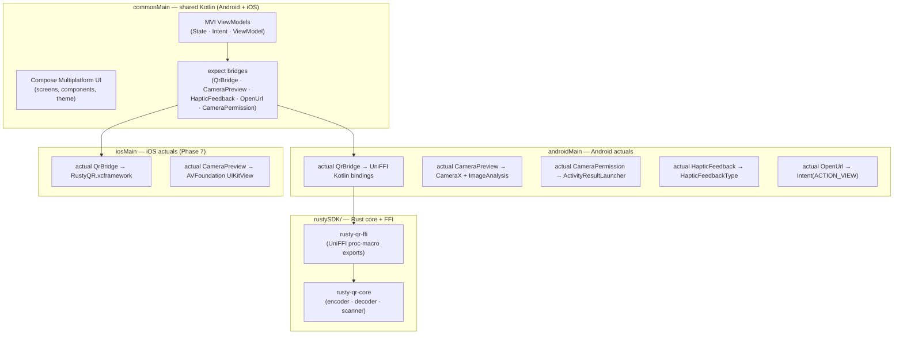
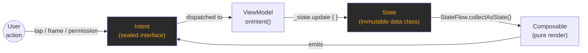
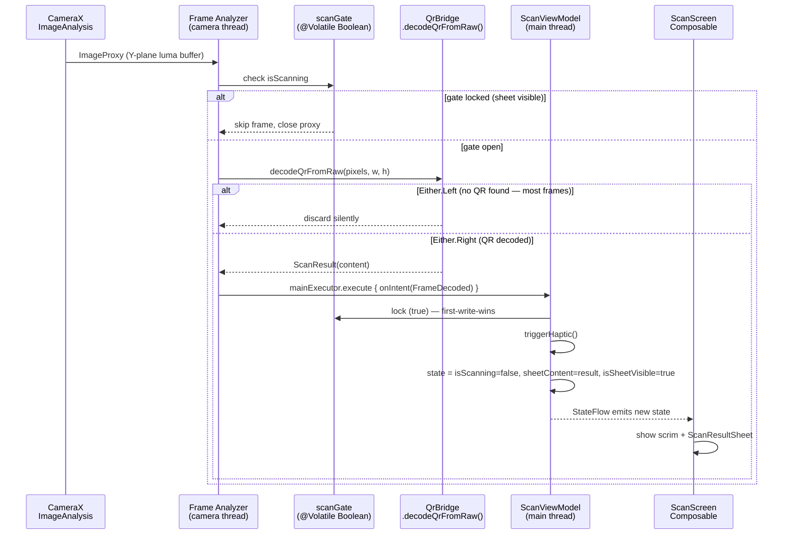
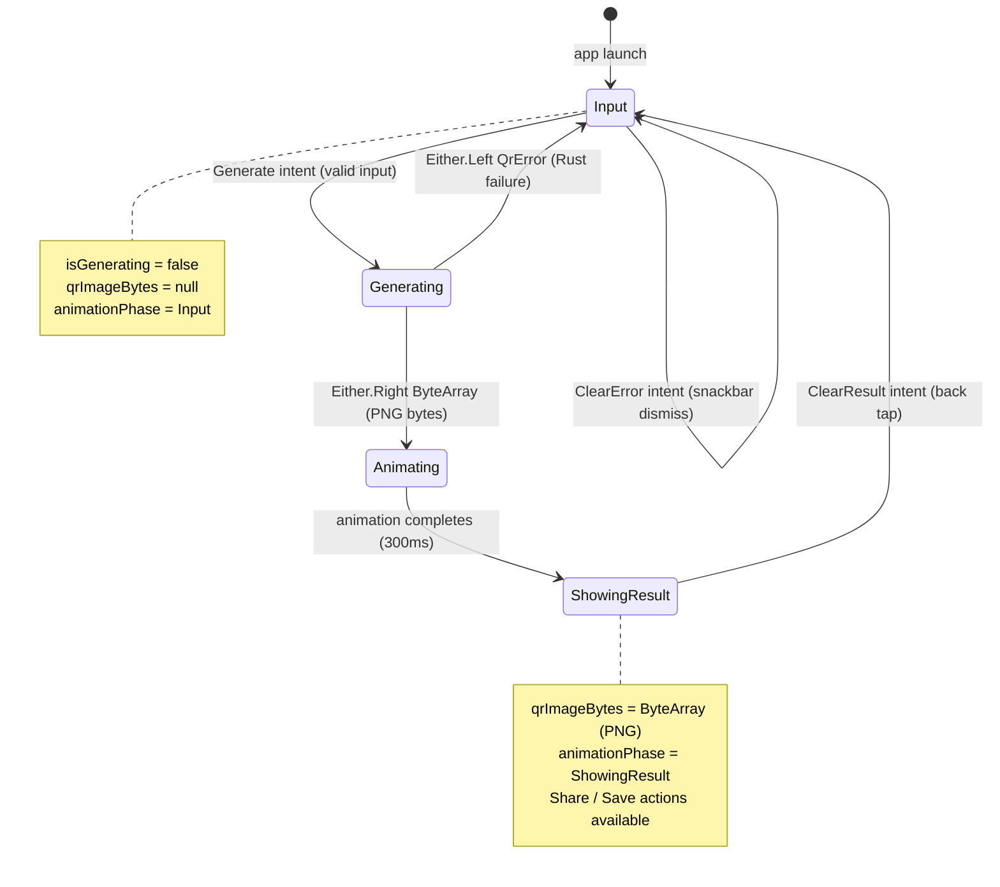
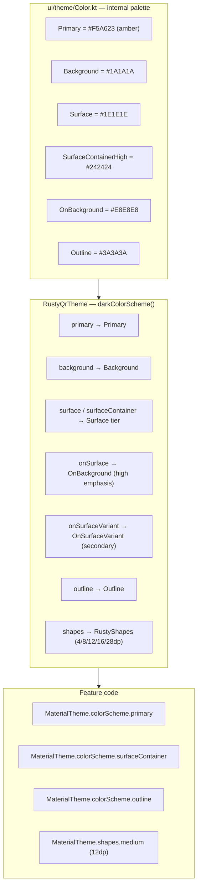
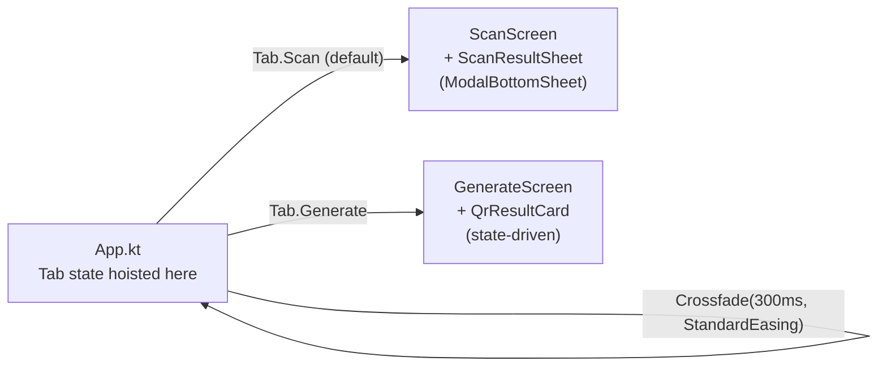
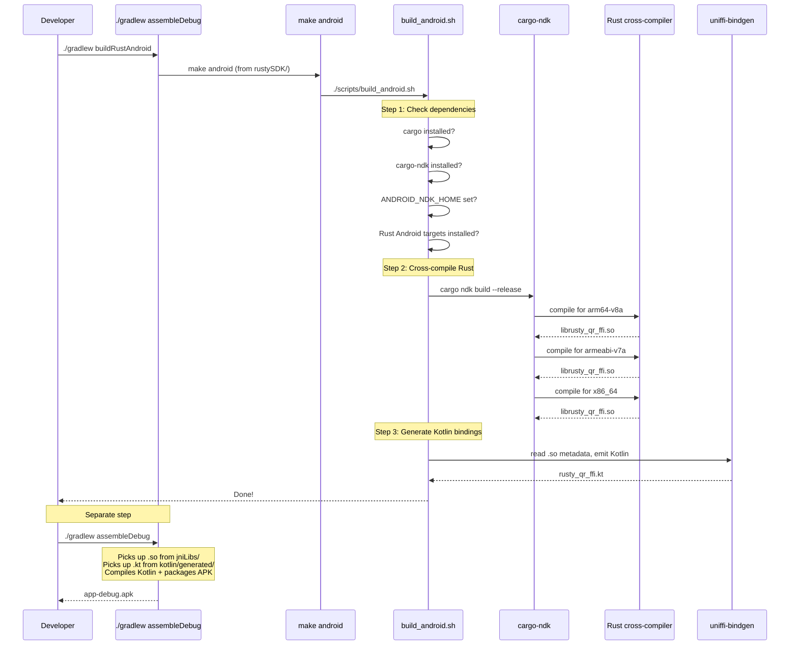
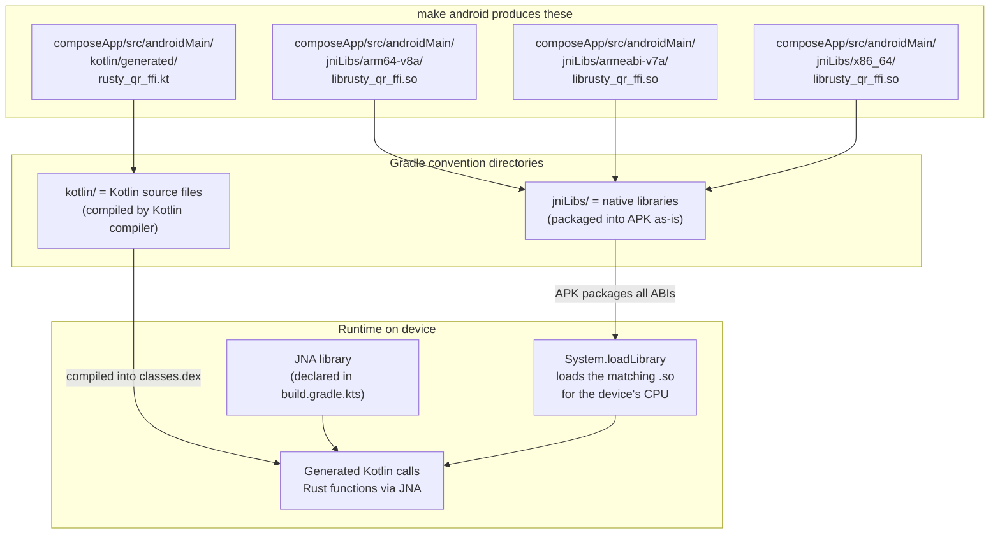
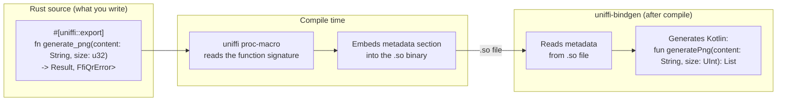

# composeApp — Android / KMP Module

This document covers two things:
1. **App architecture** — how the KMP codebase is structured, how data flows, how the UI is built
2. **Build pipeline** — how the Rust QR library gets compiled and packaged into the Android app

---

## App Architecture

### KMP Layer Overview

The app is written with **Kotlin Multiplatform + Compose Multiplatform**. Code lives in three source sets:



All business logic and UI live in `commonMain`. Platform code is minimal — only what the OS requires (camera access, file I/O, haptics).

---

### MVI Architecture

Every screen follows the **Model–View–Intent** pattern with strict unidirectional data flow:



Rules enforced across all screens:
- **State** is an immutable `data class` — no `var` properties exposed to composables
- **Intent** is a `sealed interface` — every user action is an explicit type, not a callback
- **ViewModel** contains all business logic — composables are pure render functions
- **Side effects** (haptics, navigation, permission requests) are triggered inside `onIntent()`, never from composables
- **Error contract**: `ArrowKT Either<DomainError, T>` — never throw for domain errors, never `kotlin.Result<T>`

---

### Package Structure

```
composeApp/src/commonMain/kotlin/com/p2/apps/rustyqr/
│
├── App.kt                          # Root composable — tab state, Crossfade, RustyQrTheme
│
├── navigation/
│   └── Tab.kt                      # Tab enum: Scan | Generate
│
├── bridge/                         # All expect/actual declarations (never in feature packages)
│   ├── QrBridge.kt                 # expect — Rust encode/decode functions
│   ├── CameraPreview.kt            # expect — camera composable
│   ├── CameraPermission.kt         # expect — permission check + request
│   ├── HapticFeedback.kt           # expect — haptic tap trigger
│   ├── OpenUrl.kt                  # expect — URL intent / UIApplication.open
│   └── ImageDecoder.kt             # expect — PNG bytes → ImageBitmap
│
├── model/
│   ├── ScanResult.kt               # data class ScanResult(content: String)
│   └── QrError.kt                  # sealed class QrError (InvalidInput · Encoding · Decoding · Image)
│
├── scan/
│   ├── ScanScreenState.kt          # State: isScanning · sheetContent · isSheetVisible · permission flags
│   ├── ScanIntent.kt               # Intent: FrameDecoded · DismissSheet · ResumeScanning · Permission*
│   ├── ScanViewModel.kt            # AtomicBoolean scan gate · state management
│   ├── ScanScreen.kt               # ScanScreen (wiring) + ScanContent (render) + PermissionDeniedContent
│   ├── ScannerOverlay.kt           # Amber corner brackets (Canvas draw)
│   └── ScanResultSheet.kt          # ModalBottomSheet — badge, decoded text, action row
│
├── result/
│   ├── QrContentType.kt            # sealed class: Url · PlainText
│   └── ContentTypeDetector.kt      # (future) detect URL vs plain text in decoded content
│
├── generate/
│   ├── GenerateScreenState.kt      # State: inputText · qrImageBytes · isGenerating · animationPhase · error
│   ├── GenerateIntent.kt           # Intent: UpdateText · Generate · ClearResult · ClearError
│   ├── GenerateViewModel.kt        # Calls QrBridge.generateQrPng on Dispatchers.IO via ArrowKT fold
│   ├── GenerateScreen.kt           # Input + generate button + error snackbar + IME handling
│   ├── QrResultCard.kt             # OutlinedCard — QR image, share/save icon buttons (48dp targets)
│   └── AnimatedGenerateContent.kt  # Orchestrates text-animate-down + card-fade-in with MD3 easing
│
└── ui/
    ├── theme/
    │   ├── RustyQrTheme.kt         # MaterialTheme wrapper — dark-only, no dynamic color
    │   ├── Color.kt                # Palette constants — internal to theme; feature code uses colorScheme.*
    │   ├── Type.kt                 # JetBrains Mono + Inter typography scale
    │   ├── Shape.kt                # RustyShapes (4/8/12/16/28dp MD3 scale)
    │   └── Motion.kt              # MD3 easing: StandardEasing · EmphasizedDecelerate · EmphasizedAccelerate
    └── components/
        ├── PillTabBar.kt           # Pill toggle with amber fill, selectableGroup, Role.Tab semantics
        ├── AmberButton.kt          # Primary filled button (amber bg, dark text, JetBrains Mono)
        ├── OutlineButton.kt        # Secondary outline button (amber border)
        └── ContentTypeBadge.kt    # Small "URL" / "TEXT" pill badge
```

---

### Scan Feature — Data Flow

How a camera frame becomes a decoded result shown on screen:



Key design decisions:
- **Gate is `@Volatile Boolean`**, not `AtomicBoolean` — fast read on camera thread, no lock overhead
- **Camera session stays alive** when `isScanning = false` — avoids black flash when sheet dismisses
- **`Either.Left` frames are silently discarded** — most frames have no QR; this is the expected case

---

### Generate Feature — State Machine



---

### MD3 Theme System

The app uses a custom **dark-only** Material 3 colour scheme. All feature code accesses colours through `MaterialTheme.colorScheme.*` — never direct imports from `Color.kt`.



**Typography:** JetBrains Mono (titles, badges, buttons, code-style content) + Inter (body, inputs, labels). Both bundled as `.ttf` in `commonMain/composeResources/font/`.

**Motion:** MD3 easing curves from `ui/theme/Motion.kt`:
- `StandardEasing` → tab crossfade, colour animations
- `EmphasizedDecelerate` → elements entering (QR card appear)
- `EmphasizedAccelerate` → elements leaving (text animates down)

---

### Navigation

No navigation library — two top-level tabs with `Crossfade`. The result is a `ModalBottomSheet` driven by `ScanViewModel` state, not a navigation destination (see `docs/adr/002-scan-to-result-navigation.md`).



Camera lifecycle is tied to tab visibility — `CameraPreview` is only composed when `Tab.Scan` is active. Switching to Generate unbinds the camera; switching back rebinds without a black flash.

---

## Android Build: From Rust to APK

This document explains how the Rust QR library gets compiled, wrapped in Kotlin bindings, and packaged into the Android app. If you've never used `make` or worked with native bindings before, start here.

---

## What Problem Does This Solve?

The QR code logic is written in **Rust**, but Android apps are written in **Kotlin**. Kotlin can't call Rust directly — they're different languages running in different runtimes. We need two things:

1. **A compiled Rust library** (`.so` file) that Android can load at runtime
2. **Generated Kotlin code** that knows how to call the functions inside that library

The build pipeline automates both steps.

---

## Building the App

```bash
# Compile Rust + generate Kotlin bindings
./gradlew :composeApp:buildRustAndroid

# Build the Android APK (picks up everything from above automatically)
./gradlew :composeApp:assembleDebug

# Or chain both in one line:
./gradlew :composeApp:buildRustAndroid :composeApp:assembleDebug
```

### When do I need to rebuild Rust?

Only when you change Rust code in `rustySDK/`. If you're only editing Kotlin or UI, skip `buildRustAndroid` and just run `assembleDebug` — it's much faster.

Everything below explains what happens inside these commands.

---

## What is `make`?

`make` is a build automation tool that's been around since 1976. It reads a file called `Makefile` and runs the commands defined for each "target". Think of it as a script runner with named entry points:

```makefile
# rustySDK/Makefile

android:              # ← this is a "target" (the name you pass to make)
    ./scripts/build_android.sh    # ← this is what runs when you type "make android"

test:
    cargo test --workspace
    cargo clippy --workspace -- -D warnings
    cargo fmt --check

clean:
    cargo clean
    rm -rf ../composeApp/src/androidMain/jniLibs
    rm -rf ../composeApp/src/androidMain/kotlin/generated
```

| Command | What it does |
|---------|-------------|
| `make android` | Cross-compiles Rust for Android + generates Kotlin bindings |
| `make test` | Runs all Rust tests, linter, and format checker |
| `make clean` | Deletes all compiled artifacts (start fresh) |
| `make` | Runs `make all` (= `test` then `android`) |

---

## What Happens Inside `make android`

`make android` calls `rustySDK/scripts/build_android.sh`, which does three things in order:

### 1. Check dependencies

The script verifies your machine has everything installed before doing any work. If anything is missing, it tells you exactly what to install:

```
ERROR: Missing dependencies:
  - cargo-ndk (run: cargo install cargo-ndk)
  - ANDROID_NDK_HOME (set this env var to your NDK path)
  - Rust target aarch64-linux-android (run: rustup target add aarch64-linux-android)
```

### 2. Cross-compile Rust for Android

The Rust compiler normally produces binaries for your Mac. To produce binaries that run on Android phones, we need a **cross-compiler** — it runs on your Mac but outputs ARM/x86 code that Android understands.

`cargo-ndk` handles this. It invokes the Rust compiler three times, once per CPU architecture:

| Architecture | Who uses it | Output file |
|-------------|------------|-------------|
| `arm64-v8a` | All modern Android phones (64-bit ARM) | `jniLibs/arm64-v8a/librusty_qr_ffi.so` |
| `armeabi-v7a` | Older 32-bit ARM devices | `jniLibs/armeabi-v7a/librusty_qr_ffi.so` |
| `x86_64` | Android emulator on your Mac | `jniLibs/x86_64/librusty_qr_ffi.so` |

The `.so` files (shared objects) are native libraries — the equivalent of a `.dll` on Windows or a `.dylib` on Mac.

All `.so` files are built with **16KB ELF page alignment** (`align 2**14`), compliant with [Android's 16KB page size requirement](https://developer.android.com/guide/practices/page-sizes) effective November 2025. This is handled automatically by NDK 28+ (we use NDK 30) — no extra linker flags needed. AGP 9.1 handles the zip alignment at APK packaging time.

### 3. Generate Kotlin bindings

The `.so` file contains Rust functions, but Kotlin doesn't know their names, parameter types, or return types. **UniFFI** solves this by reading metadata embedded in the `.so` and generating a Kotlin file that wraps every Rust function in a Kotlin-friendly API:

```
Rust function:  generate_png(content: &str, size: u32) -> Result<Vec<u8>, QrError>
                              ↓ uniffi-bindgen generates ↓
Kotlin function: fun generatePng(content: String, size: UInt): List<UByte>
                 (throws FfiQrException on error)
```

The generated file lands at:
```
composeApp/src/androidMain/kotlin/generated/com/p2/apps/rustyqr/rust/rusty_qr_ffi.kt
```

---

## The Full Pipeline



---

## How Gradle Picks Up the Artifacts

Gradle doesn't need any special configuration to find the outputs. It uses **convention-based source directories** — if files are in the right place, Gradle includes them automatically:



**`jniLibs/`** is a magic directory name for Android Gradle Plugin — any `.so` files inside `jniLibs/<abi>/` are automatically copied into the APK. The device extracts only the `.so` matching its own CPU when the app is installed.

**`kotlin/`** (or `java/`) under a source set is where Gradle looks for source files to compile. The generated `rusty_qr_ffi.kt` is treated like any other Kotlin file.

**JNA** (Java Native Access) is a runtime library declared in `build.gradle.kts`. The generated Kotlin code uses JNA to load `librusty_qr_ffi.so` and call its functions. Without JNA, the Kotlin code would compile but crash at runtime.

---

## How UniFFI Metadata Works

You might wonder: how does `uniffi-bindgen` know what Kotlin code to generate?

The answer is **proc-macros** — Rust compile-time code generators. When the Rust FFI crate is compiled, annotations like `#[uniffi::export]` expand into metadata that gets embedded directly into the `.so` binary:



This means the generated Kotlin is always in sync with the Rust code — if you change a function signature in Rust, re-running `./gradlew :composeApp:buildRustAndroid` regenerates the Kotlin to match.

---

## Why Three `.so` Files but One `.kt` File?

**Three `.so` files** because each CPU architecture needs its own machine code. ARM code can't run on x86 and vice versa.

**One `.kt` file** because the Kotlin code is architecture-independent — it calls Rust functions by name (e.g., "generate_png"), and JNA resolves those names against whichever `.so` was loaded on the device. The UniFFI metadata in all three `.so` files is identical (same function names, same types), so any one can be used as the source for code generation.

---

## First-Time Setup

If the dependency check fails, run this once:

```bash
# 1. Install Rust
curl --proto '=https' --tlsv1.2 -sSf https://sh.rustup.rs | sh

# 2. Add Android cross-compilation targets
rustup target add aarch64-linux-android armv7-linux-androideabi x86_64-linux-android

# 3. Install cargo-ndk (the cross-compilation wrapper)
cargo install cargo-ndk

# 4. Set ANDROID_NDK_HOME (add to your ~/.zshrc or ~/.bashrc)
export ANDROID_NDK_HOME="$HOME/Library/Android/sdk/ndk/$(ls $HOME/Library/Android/sdk/ndk | tail -1)"
```

After that, every build is:

```bash
./gradlew :composeApp:buildRustAndroid :composeApp:assembleDebug
```

---

## Cleaning Up

```bash
./gradlew :composeApp:cleanBuildIos
```

This cleans all Rust artifacts (both platforms) and rebuilds from scratch, removing:
- `rustySDK/target/` — all Rust compiled objects
- `composeApp/src/androidMain/jniLibs/` — the `.so` files
- `composeApp/src/androidMain/kotlin/generated/` — the generated Kotlin binding

After cleaning, rebuild Android with `./gradlew :composeApp:buildRustAndroid`.
