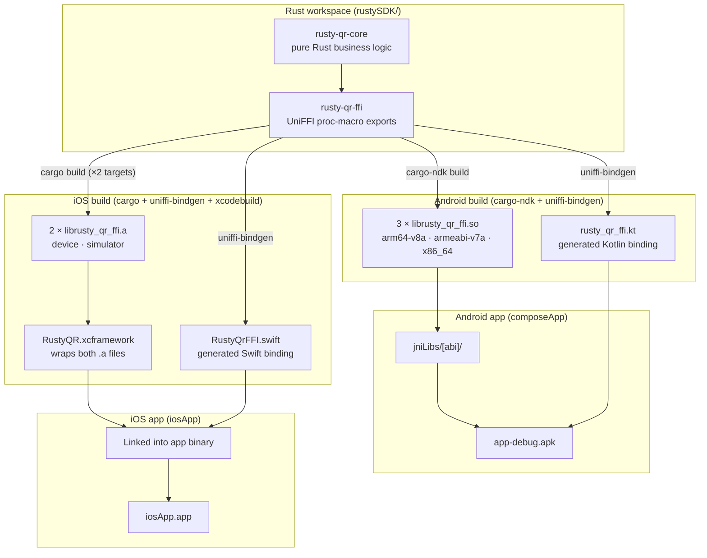
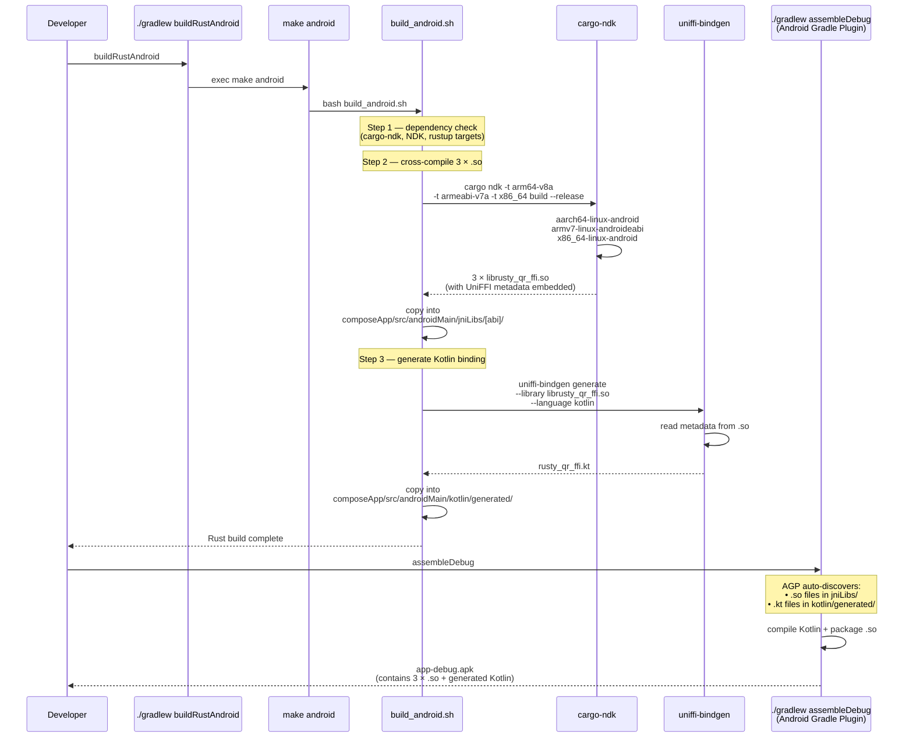
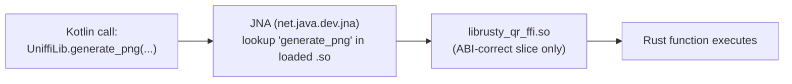
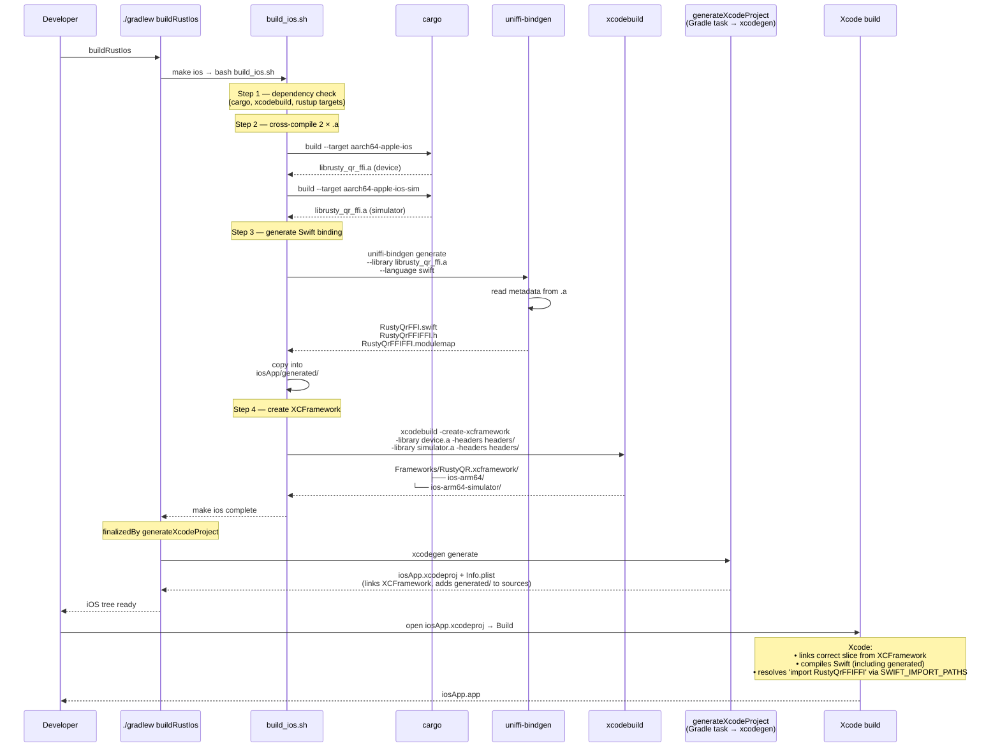
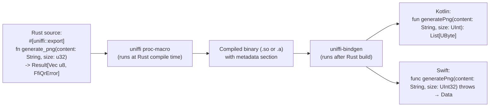
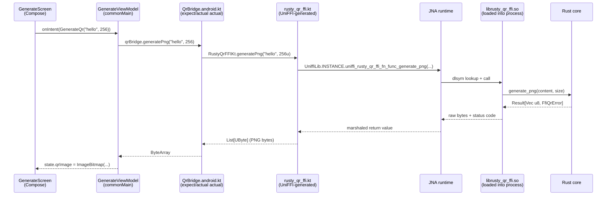
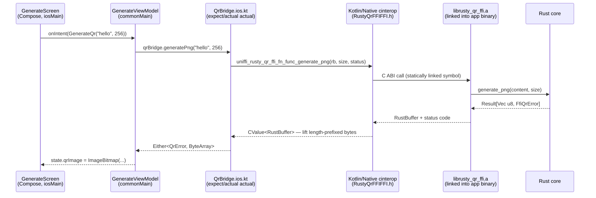

# Rusty-QR — Architecture & Build Pipeline

**Audience:** anyone who wants to understand how one Rust codebase becomes two native apps.

This is the deep dive. It walks the full path from a `.rs` source file to a QR code rendered on a
phone, with sequence diagrams for every non-trivial step. Start at the top and read front-to-back;
every section builds on the previous one.

Sibling docs:

- [Root README](../README.md) — product overview, screenshots, feature list
- [`composeApp/README.md`](../composeApp/README.md) — KMP module reference (shared Compose UI, MVI, `bridge/` pattern)
- [`composeApp/src/androidMain/README.md`](../composeApp/src/androidMain/README.md) — Android actuals + build pipeline
- [`iosApp/README.md`](../iosApp/README.md) — iOS Xcode project reference
- [`rustySDK/README.md`](../rustySDK/README.md) — Rust crate reference

---

## Table of Contents

1. [The Big Picture](#the-big-picture)
2. [Why Not an AAR or a `.framework`?](#why-not-an-aar-or-a-framework)
3. [The Shared Foundation — Rust + UniFFI](#the-shared-foundation--rust--uniffi)
4. [Android Branch — `.rs` to installable APK](#android-branch--rs-to-installable-apk)
5. [iOS Branch — `.rs` to Xcode-ready XCFramework](#ios-branch--rs-to-xcode-ready-xcframework)
6. [UniFFI Metadata — How Bindings Stay in Sync](#uniffi-metadata--how-bindings-stay-in-sync)
7. [Runtime — What Happens When the App Calls Rust](#runtime--what-happens-when-the-app-calls-rust)
8. [Type Mapping Across the FFI Boundary](#type-mapping-across-the-ffi-boundary)
9. [Glossary — Files and Formats](#glossary--files-and-formats)

---

## The Big Picture

One Rust workspace produces native binaries for two platforms. The Kotlin and Swift bindings that
call those binaries are **auto-generated** from the Rust source — no hand-written JNI, no C
bridging headers.



The key insight: **both platforms consume the same Rust source**. Only the packaging differs.

---

## Why Not an AAR or a `.framework`?

If you've shipped Android libraries before, you'd expect an **AAR** (Android Archive — a zip
containing compiled classes, resources, and native `.so` files). If you've shipped iOS libraries,
you'd expect a **`.framework`** or an XCFramework.

### Android: no AAR, just raw `.so` files

This repo does **not** produce an AAR because the Rust library lives *inside* the same Gradle
module as the app code (`composeApp`). There's nothing to package and redistribute — the `.so`
files get dropped directly into `composeApp/src/androidMain/jniLibs/`, and the Android Gradle
Plugin (AGP) picks them up automatically when it builds the APK.

You'd only need an AAR if:

- You wanted to publish the Rust library to Maven for other apps to consume, or
- You wanted to isolate Rust into its own Gradle module with a clean dependency boundary.

Neither applies here — this is a single-app project.

### iOS: yes, an XCFramework (sort of)

iOS does produce an `RustyQR.xcframework` because Xcode's linker needs a packaged artifact
containing both device and simulator slices. The XCFramework is just a directory with a specific
layout — think of it as the minimum ceremony Xcode demands, not a redistributable library.

```
Android flow:  cargo-ndk builds 3 × .so  →  jniLibs/  →  AGP packages into APK
iOS flow:      cargo builds 2 × .a       →  xcodebuild -create-xcframework  →  Xcode links into app
```

On Android, `jniLibs/` is a magic directory name — AGP auto-discovers any `.so` inside it. On iOS,
Xcode needs the XCFramework wrapper because `.a` files on their own don't carry the platform
metadata Xcode uses to pick "device vs simulator" at build time.

---

## The Shared Foundation — Rust + UniFFI

Both branches start from the same place: the `rusty-qr-ffi` crate, which wraps `rusty-qr-core` and
annotates every public function with a UniFFI macro.

```rust
// rustySDK/crates/ffi/src/lib.rs
#[uniffi::export]
fn generate_png(content: String, size: u32) -> Result<Vec<u8>, FfiQrError> {
    rusty_qr_core::encoder::generate_png(&content, size).map_err(FfiQrError::from)
}
```

The `#[uniffi::export]` macro does two things at compile time:

1. Makes the function callable from C (the common substrate underneath both Kotlin/JNA and Swift).
2. Embeds a **metadata record** into the compiled binary describing the function's signature.

That metadata is how `uniffi-bindgen` later emits matching Kotlin and Swift code without you
writing bridging boilerplate. More on that in
[UniFFI Metadata](#uniffi-metadata--how-bindings-stay-in-sync).

### Crate layout

```
rustySDK/
├── Cargo.toml                 # workspace definition
└── crates/
    ├── core/                  # pure Rust — no FFI, no UniFFI
    ├── ffi/                   # UniFFI exports + type wrappers (cdylib + staticlib)
    └── uniffi-bindgen/        # CLI tool that reads .so/.a metadata → emits .kt/.swift
```

The `ffi` crate declares **two** library types:

```toml
[lib]
crate-type = ["cdylib", "staticlib"]
```

| Output      | Format                | Used by                                                    |
|-------------|-----------------------|------------------------------------------------------------|
| `cdylib`    | `.so` (Linux/Android) | Android — loaded at runtime via JNA                        |
| `staticlib` | `.a` (static archive) | iOS — linked into the app binary at compile time by Xcode  |

One source, two output formats. The Android build asks for `cdylib`; the iOS build asks for
`staticlib`.

---

## Android Branch — `.rs` to installable APK

The full Android pipeline is driven by one Gradle task: `./gradlew :composeApp:buildRustAndroid`.
It shells out to `make android` in `rustySDK/`, which runs `scripts/build_android.sh`.



### Why three `.so` files but one `.kt` file?

- **Three `.so` files** — each Android CPU architecture (arm64, arm32, x86_64) needs its own
  machine code. At install time the device only keeps the `.so` matching its CPU.
- **One `.kt` file** — the Kotlin binding calls Rust functions *by name* through JNA at runtime.
  The name resolution happens against whichever `.so` was loaded, so the Kotlin code is
  architecture-independent. The UniFFI metadata is identical in all three `.so` files, so any one
  of them can be used as the source for binding generation.

### What's inside `jniLibs/`

```
composeApp/src/androidMain/jniLibs/
├── arm64-v8a/librusty_qr_ffi.so       # most modern phones
├── armeabi-v7a/librusty_qr_ffi.so     # legacy 32-bit ARM
└── x86_64/librusty_qr_ffi.so          # Mac-hosted emulators
```

All three are built with 16KB ELF page alignment (Android's November 2025 requirement). NDK 28+
handles that automatically — no extra linker flags needed.

### How JNA loads the `.so` at runtime

The UniFFI-generated Kotlin code calls Rust functions through **JNA** (Java Native Access), not
`System.loadLibrary`. JNA is a runtime library that discovers and calls C functions by name:



JNA is declared in `composeApp/build.gradle.kts` via the `androidMainImplementation`
configuration. Without JNA, the generated Kotlin would compile but crash on the first call.

---

## iOS Branch — `.rs` to Xcode-ready XCFramework

The iOS pipeline is driven by one Gradle task: `./gradlew :composeApp:buildRustIos`. Responsibility
is split — Make produces Rust/bindings/XCFramework, Gradle regenerates `iosApp.xcodeproj` from
`project.yml`. `buildRustIos` shells out to `make ios` (via `rustySDK/scripts/build_ios.sh`) and is
finalized by the `generateXcodeProject` Gradle task, so a single invocation delivers a buildable
iOS tree.



### What's inside the XCFramework

```
iosApp/Frameworks/RustyQR.xcframework/
├── Info.plist                          # tells Xcode which slice is which
├── ios-arm64/                          # device slice
│   ├── librusty_qr_ffi.a
│   └── Headers/
│       ├── RustyQrFFIFFI.h
│       └── RustyQrFFIFFI.modulemap
└── ios-arm64-simulator/                # simulator slice
    ├── librusty_qr_ffi.a
    └── Headers/
        ├── RustyQrFFIFFI.h
        └── RustyQrFFIFFI.modulemap
```

When Xcode compiles the app, it reads `Info.plist`, looks at the current build destination
(simulator or device), and links the matching `.a`. You never have to switch manually.

### Why XcodeGen?

Xcode's native project format (`.pbxproj`) is opaque XML full of random UUIDs that change on every
save. It's unreviewable in PRs and produces constant merge conflicts.

**XcodeGen** solves this by treating `.xcodeproj` as a *generated artifact* — you edit a
human-readable YAML file (`iosApp/project.yml`) and run `xcodegen generate` to rebuild the project
file. The `.xcodeproj` is gitignored; `project.yml` is the source of truth.

### How Xcode picks up the generated Swift

Three `project.yml` settings wire everything together:

1. **Dependencies list** — `Frameworks/RustyQR.xcframework` is declared as a linked framework.
2. **Sources list** — `iosApp/generated/` is listed as a source group, so XcodeGen adds
   `RustyQrFFI.swift` to the compile sources.
3. **`SWIFT_IMPORT_PATHS`** — this build setting points at `iosApp/generated/` so the Swift
   compiler can find `RustyQrFFIFFI.modulemap`. That's what lets `RustyQrFFI.swift` say
   `import RustyQrFFIFFI` without a manual bridging header.

---

## UniFFI Metadata — How Bindings Stay in Sync

Both branches depend on a crucial magic trick: UniFFI embeds a description of every exported
function *into* the compiled binary. `uniffi-bindgen` reads that description back out to generate
the Kotlin and Swift code.



### What this buys you

1. **No drift.** Change a Rust function signature, rebuild, and the Kotlin + Swift regenerate to
   match. If the bindings are out of sync with Rust, you'll get a *compile* error in the mobile app,
   not a runtime crash.
2. **No hand-written JNI or C headers.** The whole "how do I call Rust from Kotlin?" problem is
   solved by code generation.
3. **Idiomatic output.** UniFFI emits `data class`es for Kotlin, `struct`s for Swift, sealed
   exceptions with typed variants, etc. Feels native on both sides.

### Where bindings land

| Platform | Generated file(s)                                                   | Lives in                                                    |
|----------|---------------------------------------------------------------------|-------------------------------------------------------------|
| Android  | `rusty_qr_ffi.kt`                                                   | `composeApp/src/androidMain/kotlin/generated/com/p2/apps/rustyqr/rust/` |
| iOS      | `RustyQrFFI.swift` + `RustyQrFFIFFI.h` + `RustyQrFFIFFI.modulemap`  | `iosApp/generated/`                                         |

Both directories are **gitignored**. They're regenerated on every Rust build.

---

## Runtime — What Happens When the App Calls Rust

The build-time story above gets you a binary with everything wired up. Here's the runtime story
for a single QR generation call, on both platforms:

### Android



### iOS



The key difference: on Android JNA does a **runtime** symbol lookup into a dynamically loaded
`.so`; on iOS the symbol is resolved at **link time** because the `.a` was statically linked into
the app binary. Kotlin/Native cinterop consumes the UniFFI-generated C header directly — no Swift
round-trip. Everything above that boundary is identical — same Compose UI, same ViewModel, same
`QrBridge` expect declaration.

---

## Type Mapping Across the FFI Boundary

UniFFI converts between Rust types and platform types automatically. The FFI wrapper types (`Ffi*`)
exist because the core crate deliberately has no UniFFI dependency — the wrapper crate adds the
annotations and does the conversion.

| Rust (core)         | Rust (ffi wrapper)     | Kotlin (generated)                  | Swift (generated)             |
|---------------------|------------------------|-------------------------------------|-------------------------------|
| `QrErrorCorrection` | `FfiQrErrorCorrection` | `FfiQrErrorCorrection` (enum class) | `FfiQrErrorCorrection` (enum) |
| `QrConfig`          | `FfiQrConfig`          | `FfiQrConfig` (data class)          | `FfiQrConfig` (struct)        |
| `ScanResult`        | `FfiScanResult`        | `FfiScanResult` (data class)        | `FfiScanResult` (struct)      |
| `QrError`           | `FfiQrError`           | `FfiQrException` (sealed class)     | `FfiQrError` (enum)           |
| `Vec<u8>`           | `Vec<u8>`              | `List<UByte>`                       | `Data`                        |
| `String`            | `String`               | `String`                            | `String`                      |
| `u32`               | `u32`                  | `UInt`                              | `UInt32`                      |

Conversion flow:

- **Inputs** (app → Rust): `FfiQrConfig` → `QrConfig` via `From` impls in the `ffi` crate.
- **Outputs** (Rust → app): `ScanResult` → `FfiScanResult` via `From` impls in the `ffi` crate.
- **Errors**: `QrError` → `FfiQrError` → platform-native exception type.

---

## Glossary — Files and Formats

| Term              | What it is                                                                                            |
|-------------------|-------------------------------------------------------------------------------------------------------|
| `.rs`             | Rust source file                                                                                      |
| `.so`             | Shared object — a dynamically loaded library on Linux/Android                                         |
| `.a`              | Static archive — a bundle of object files linked directly into another binary at compile time        |
| `cdylib`          | Cargo crate type that produces a `.so` / `.dylib` (C-compatible dynamic library)                      |
| `staticlib`       | Cargo crate type that produces a `.a` (C-compatible static archive)                                   |
| `jniLibs/`        | Magic Android Gradle Plugin directory — any `.so` inside is auto-packaged into the APK               |
| AAR               | Android Archive — zipped library artifact (classes + resources + `.so`). **Not used in this repo.**  |
| XCFramework       | Apple's multi-platform packaging format; a directory containing `.a` or `.framework` slices per target |
| `.xcframework`    | Suffix of an XCFramework directory — `iosApp/Frameworks/RustyQR.xcframework/`                         |
| `.xcodeproj`      | Xcode project bundle (directory). Gitignored here — regenerated from `project.yml` by XcodeGen        |
| `project.yml`     | XcodeGen's human-readable project spec — the source of truth for `.xcodeproj`                         |
| `project.pbxproj` | Opaque XML file inside `.xcodeproj` — auto-generated, never edited by hand                            |
| `.modulemap`      | Swift's mechanism for importing a C library as a module (`import RustyQrFFIFFI`)                      |
| UniFFI            | Mozilla's tool that auto-generates Kotlin/Swift bindings from annotated Rust code                     |
| JNA               | Java Native Access — runtime library that lets Kotlin/Java call C functions in a `.so` by name        |
| cargo-ndk         | Cargo wrapper that makes cross-compiling Rust for Android's NDK toolchain one command                 |
| NDK               | Android's Native Development Kit — the C/C++ toolchain bundled with Android Studio                    |

---

## Further Reading

External resources that go deeper on each piece of the pipeline. Grouped by topic so you can
follow only the threads you care about.

### UniFFI and Rust-to-mobile FFI

- **[Mozilla UniFFI user guide](https://mozilla.github.io/uniffi-rs/)** — the canonical reference.
  Start with "Tutorial" for the end-to-end mental model, then dip into "Udl" (legacy) or
  "Proc-macro" (what this repo uses) depending on the style you're reading in the wild.
- **[Introducing UniFFI (Mozilla Hacks)](https://hacks.mozilla.org/2021/01/announcing-uniffi-cross-platform-component-interfaces/)**
  — the original announcement post. Short, explains *why* Mozilla built it and what problem it
  solves for the Firefox/Application Services team.
- **[Mozilla Application Services — Rust architecture](https://mozilla.github.io/application-services/book/design/megazords.html)**
  — the "megazord" pattern. Real-world production deployment of UniFFI across Firefox iOS,
  Android, and Desktop. Useful if you're curious how this scales to many crates.
- **[ssokolow — Rust FFI cheatsheet](https://web.archive.org/web/20230324134226/https://blog.ssokolow.com/archives/2017/05/17/rust-ffi-a-quick-hello-world-with-python/)**
  — old but still correct primer on the raw mechanics under any FFI library, including UniFFI.

### Rust crate types (`cdylib`, `staticlib`, `rlib`)

- **[The Cargo Book — linkage](https://doc.rust-lang.org/reference/linkage.html)** — the
  authoritative list of crate types and what each produces. Read the table once and bookmark it.
- **[Rust FFI: Producing Shared Libraries from Rust](https://users.rust-lang.org/t/what-is-the-difference-between-dylib-and-cdylib/28847)**
  — the classic forum thread explaining `dylib` vs. `cdylib` vs. `staticlib`. Short, opinionated,
  correct. If you only read one thing to understand why `cdylib` matters for `.so` output, read
  this.
- **[Jake Goulding — Rust FFI Omnibus](http://jakegoulding.com/rust-ffi-omnibus/)** — worked
  examples of calling Rust from C, Ruby, Python, Haskell, and more. Doesn't cover Kotlin/Swift
  directly, but the mental model transfers 1:1.

### Android NDK and JNI-adjacent patterns

- **[Android NDK docs — ABI management](https://developer.android.com/ndk/guides/abis)** — the
  definitive guide to `arm64-v8a`, `armeabi-v7a`, `x86_64`, and why you need multiple slices.
- **[cargo-ndk README](https://github.com/bbqsrc/cargo-ndk)** — short, but explains *exactly*
  what the wrapper does behind the scenes when it invokes `rustc` with the NDK toolchain.
- **[Android's 16KB page size requirement](https://developer.android.com/guide/practices/page-sizes)**
  — why the Makefile specifies `-Z` flags and why NDK 28+ matters. Mandatory reading before
  shipping to the Play Store in late 2025.
- **[JNA vs. JNI — when and why](https://github.com/java-native-access/jna/blob/master/www/Frequently%20Asked%20Questions.md)**
  — the JNA FAQ. Explains the tradeoff we take by going through JNA instead of writing hand-rolled
  JNI glue. UniFFI's generated Kotlin assumes JNA; this is the "why".

### iOS: XCFrameworks, static libs, and Swift module maps

- **[Apple — Distributing Binary Frameworks as Swift Packages](https://developer.apple.com/documentation/xcode/distributing-binary-frameworks-as-swift-packages)**
  — Apple's own guide on XCFrameworks. Read the "Creating an XCFramework" section; the rest is
  SPM-specific and not relevant here.
- **[WWDC 2019 — Binary Frameworks in Swift (session 416)](https://developer.apple.com/videos/play/wwdc2019/416/)**
  — the introduction-of-XCFrameworks session. Still the clearest explanation of why the format
  exists and what problem it solves (vs. fat `.framework` binaries).
- **[Building a Rust library for iOS (mozilla.github.io)](https://mozilla.github.io/uniffi-rs/tutorial/foreign_language_bindings.html)**
  — UniFFI's tutorial specifically for Swift. Walks through `-create-xcframework` and the
  module-map generation step.
- **[Swift module maps explained (Modulabs blog)](https://clang.llvm.org/docs/Modules.html#module-maps)**
  — Clang's docs on module maps (Swift reuses this). Bookmark for when the `.modulemap` file
  confuses you.

### XcodeGen and `.xcodeproj` generation

- **[XcodeGen README](https://github.com/yonaskolb/XcodeGen)** — the project itself, with a full
  `project.yml` schema. Start here.
- **[XcodeGen project specification](https://github.com/yonaskolb/XcodeGen/blob/master/Docs/ProjectSpec.md)**
  — every knob you can turn. Keep this open in a tab while editing `project.yml`.
- **[Why we moved to XcodeGen (The Kickstarter Engineering blog)](https://kickstarter.engineering/why-we-moved-to-xcodegen-4a12c0e12a23)**
  — the "why bother" post. Explains the merge-conflict pain that `.xcodeproj` + multiple
  engineers causes and why generating it from YAML fixes it.

### Kotlin Multiplatform specifics

- **[KMP official docs — expect/actual](https://kotlinlang.org/docs/multiplatform-expect-actual.html)**
  — the language-level mechanism this repo uses for platform bridges. Worth re-reading even if
  you've used it before.
- **[Touchlab's KMP guides](https://touchlab.co/category/kmm/)** — the most production-focused
  KMP content on the internet. Their posts on Kotlin/Native memory model, Objective-C interop,
  and CI setups are excellent.
- **[JetBrains — Compose Multiplatform guides](https://www.jetbrains.com/help/kotlin-multiplatform-dev/compose-multiplatform-getting-started.html)**
  — for the UI half of the stack. Pair with the KMP docs above.

### The bigger picture — cross-platform mobile architecture

- **[Dropbox — Why we use Rust (engineering blog)](https://dropbox.tech/infrastructure/rewriting-the-heart-of-our-sync-engine)**
  — a war story on rewriting a sync engine in Rust, including the mobile FFI story.
- **[Signal — Rust iOS/Android FFI](https://signal.org/blog/asynchronous-security/)** — how
  Signal uses Rust for cryptography primitives across mobile. Architecture post rather than a
  tutorial, but gives you a sense of what "production" looks like.
- **[1Password — Rust at 1Password](https://blog.1password.com/how-we-use-rust-in-1password/)**
  — similar territory; useful for comparing architectural choices across teams that picked the
  same stack.

### Video (if you'd rather watch than read)

- **[Jon Gjengset — Crust of Rust: FFI](https://www.youtube.com/watch?v=pePqWoTnSmQ)** — one of
  the clearest video walkthroughs of Rust FFI fundamentals. Two hours; worth every minute if
  you're new to the topic.
- **[RustConf 2022 — Shipping Rust in your app with Cargo Swift](https://www.youtube.com/watch?v=Xl5OhxLKBjo)**
  — short talk on the Swift side of the pipeline, pitched at a newcomer level.

> **Tip.** If this is your first time through the pipeline, read in this order: Rust crate types
> → UniFFI tutorial → Android NDK ABI guide → XCFramework WWDC session. That mirrors the order
> of the build pipeline itself, so each new piece lands on top of context you already have.

---

**Next:** jump into the platform-specific READMEs for build commands and troubleshooting:
[Android](../composeApp/src/androidMain/README.md) · [iOS](../iosApp/README.md) · [Rust SDK](../rustySDK/README.md).
For shared KMP conventions, see [`composeApp/README.md`](../composeApp/README.md).
