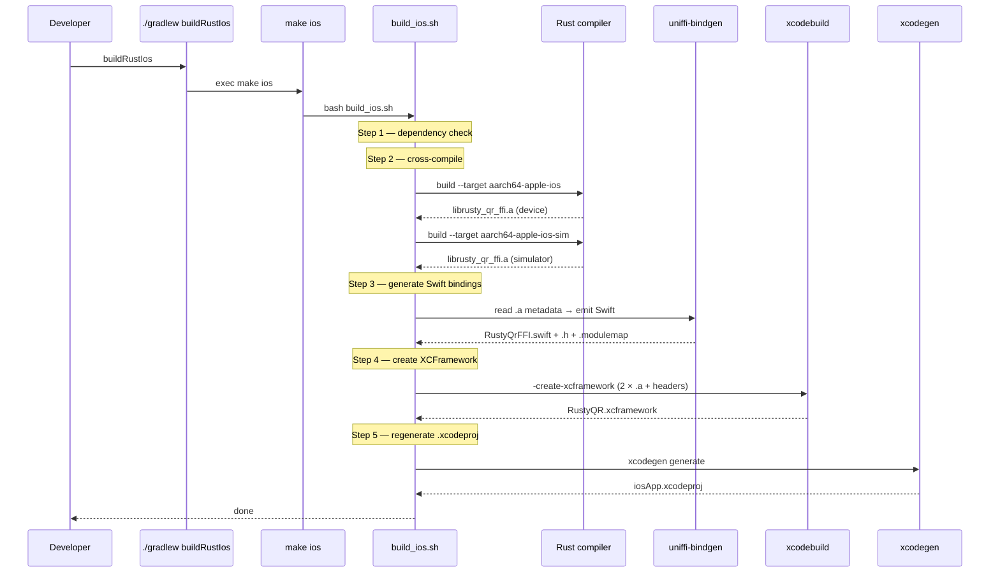
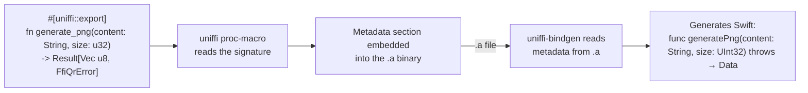

<div align="center">

# iosApp — iOS Xcode Project

### Thin UIKit shell. Compose UI through SKIA. Rust linked as an XCFramework.

<p>
  
  
  
  
  
  
</p>

<p><b>Rust <code>.a</code> · Swift bindings · XCFramework · xcodeproj — one Gradle task builds all four</b></p>

<sub>The iOS side has no native SwiftUI screens. <code>ContentView.swift</code> wraps the Compose UI exported from <code>iosMain</code>; everything else on screen is shared Kotlin.</sub>

</div>

---

> **Want the full pipeline end-to-end with sequence diagrams?**
> See [**`docs/ARCHITECTURE.md`**](../docs/ARCHITECTURE.md) — the single source of truth for how
> Rust becomes two native apps (both Android and iOS branches, runtime call paths, UniFFI deep dive).
>
> For cross-platform architecture, MVI, and shared UI, see the [top-level README](../README.md).
> Android pipeline lives in [`composeApp/README.md`](../composeApp/README.md); the Rust engine is
> documented in [`rustySDK/README.md`](../rustySDK/README.md).

---

## Status — Phase 7 In Progress

| Piece                                                         | State            |
|---------------------------------------------------------------|------------------|
| Rust `.a` for `aarch64-apple-ios` + `aarch64-apple-ios-sim`   | Built            |
| `RustyQR.xcframework` with device + simulator slices          | Built            |
| Swift bindings (`RustyQrFFI.swift` + `.h` + `.modulemap`)     | Generated        |
| `iosApp.xcodeproj` generated from `project.yml`               | Yes              |
| Shared Compose UI hosted via `MainViewController`             | Wired            |
| `iosMain` hardware bridges (camera, haptics, share, save)     | Implemented      |
| `QrBridge.ios.kt` → UniFFI Swift delegation                   | **TODO stubs**   |

`QrBridge.ios.kt` currently returns `TODO("Wired in Phase 7")`. Scan and generate will crash on iOS
until the Kotlin-side delegation into the generated Swift bindings is finished. Android is fully
functional today.

---

## Quick Start

```bash
# First-time setup
rustup target add aarch64-apple-ios aarch64-apple-ios-sim
brew install xcodegen

# Compile Rust + generate Swift bindings + create XCFramework + regenerate Xcode project
./gradlew :composeApp:buildRustIos

# Open in Xcode and run
open iosApp/iosApp.xcodeproj
```

If you're only editing Swift or shared Kotlin, skip `buildRustIos` — the last XCFramework and Swift
bindings are reused.

---

<details>
<summary><b>iOS Layout</b> — directory map and where the iOS actuals live</summary>

<br/>

```
iosApp/
├── project.yml                   # XcodeGen spec — source of truth for the Xcode project
├── iosApp.xcodeproj/             # GENERATED by XcodeGen — gitignored
│
├── iosApp/
│   ├── iOSApp.swift              # @main SwiftUI App — hosts ContentView
│   ├── ContentView.swift         # UIViewControllerRepresentable wrapping MainViewController()
│   ├── Info.plist                # NSCameraUsageDescription + app config
│   └── Assets.xcassets/          # App icon, accent color
│
├── Configuration/                # xcconfig files (build settings per configuration)
│
├── generated/                    # GENERATED by uniffi-bindgen — gitignored
│   ├── RustyQrFFI.swift          # Swift wrapper
│   ├── RustyQrFFIFFI.h           # C header for FFI functions
│   ├── RustyQrFFIFFI.modulemap   # Module map so Swift can `import RustyQrFFIFFI`
│   └── headers/                  # Copied into the XCFramework
│
└── Frameworks/
    └── RustyQR.xcframework/      # GENERATED by xcodebuild -create-xcframework — gitignored
        ├── Info.plist
        ├── ios-arm64/            # device slice
        └── ios-arm64-simulator/  # simulator slice
```

The iOS side has **no native SwiftUI screens**. `ContentView.swift` is a
`UIViewControllerRepresentable` that wraps `MainViewControllerKt.MainViewController()` — the
Compose UI exported from the KMP `iosMain` source set. Every screen (scan, generate, result sheet)
runs as Compose rendered through SKIA on iOS.

The iOS Kotlin/Native actuals live under
`composeApp/src/iosMain/kotlin/com/p2/apps/rustyqr/bridge/`:

```
composeApp/src/iosMain/kotlin/com/p2/apps/rustyqr/
├── MainViewController.kt         # fun MainViewController(): UIViewController { ComposeUIViewController { App() } }
├── Platform.ios.kt
└── bridge/
    ├── QrBridge.ios.kt           # actual — delegates to generated Swift (Phase 7 — see Status above)
    ├── CameraPreview.ios.kt      # actual — AVFoundation via UIKitView
    ├── CameraPermission.ios.kt   # actual — AVCaptureDevice.requestAccess
    ├── HapticFeedback.ios.kt     # actual — UIImpactFeedbackGenerator
    ├── OpenUrl.ios.kt            # actual — UIApplication.openURL
    ├── ShareQrImage.ios.kt       # actual — UIActivityViewController
    ├── SaveQrImage.ios.kt        # actual — PHPhotoLibrary
    └── ImageDecoder.ios.kt       # actual — UIImage → ImageBitmap
```

</details>

<details>
<summary><b>iOS Build Pipeline</b> — from Rust source to an Xcode-ready project</summary>

<br/>

Swift can't call Rust directly — they're different languages. Three things need to happen:

1. **Compiled Rust libraries** (`.a` static archives) for both device and simulator
2. **An XCFramework** that bundles both `.a` files so Xcode picks the right slice automatically
3. **Generated Swift code** that knows how to call the functions inside the Rust library

`buildRustIos` is a Gradle `Exec` task that invokes `make ios` in `rustySDK/`. Developers never run
`make` directly — Gradle is the only entry point. `make ios` calls
`rustySDK/scripts/build_ios.sh`, which does five things:

### 1. Dependency check

Verifies `cargo`, `xcodebuild`, `xcodegen`, and the two iOS Rust targets are installed. If anything
is missing, it prints the exact install command.

### 2. Cross-compile Rust

`cargo build` runs twice, once per target:

| Target                  | Who uses it                         | Output file                     |
|-------------------------|-------------------------------------|---------------------------------|
| `aarch64-apple-ios`     | Physical iPhones and iPads          | `librusty_qr_ffi.a` (device)    |
| `aarch64-apple-ios-sim` | iOS Simulator on Apple Silicon Macs | `librusty_qr_ffi.a` (simulator) |

The `.a` files are static archives — the iOS equivalent of Android's `.so` files. "Static" means
the library code is copied directly into the app binary at link time.

### 3. Generate Swift bindings

`uniffi-bindgen` reads UniFFI metadata embedded in the `.a` and emits three files in
`iosApp/generated/`:

- `RustyQrFFI.swift` — the Swift wrapper code
- `RustyQrFFIFFI.h` — C header for the FFI functions
- `RustyQrFFIFFI.modulemap` — tells Swift how to import the C module

```
Rust:   generate_png(content: &str, size: u32) -> Result<Vec<u8>, QrError>
        ↓  uniffi-bindgen generates  ↓
Swift:  func generatePng(content: String, size: UInt32) throws -> Data
        (throws FfiQrError on failure)
```

### 4. Create the XCFramework

An **XCFramework** is Apple's standard packaging format for compiled libraries supporting multiple
platforms. `xcodebuild -create-xcframework` bundles the device `.a` and the simulator `.a` into a
single directory:

```
Frameworks/RustyQR.xcframework/
├── Info.plist
├── ios-arm64/                   ← device slice
│   └── librusty_qr_ffi.a
└── ios-arm64-simulator/         ← simulator slice
    └── librusty_qr_ffi.a
```

When you build the app in Xcode, it automatically picks the right slice — device `.a` for a real
iPhone, simulator `.a` for the simulator. You never have to think about which one to use.

The script also prepares a `headers/` directory with the C header and module map, which get
embedded into the XCFramework so Xcode can resolve the module imports.

### 5. Regenerate the Xcode project

Finally, `xcodegen generate` regenerates `.xcodeproj` from `project.yml`. This ensures the Xcode
project picks up the newly created XCFramework and generated Swift sources.

### Full pipeline



</details>

<details>
<summary><b>XcodeGen Deep Dive</b> — <code>project.yml</code> as source of truth</summary>

<br/>

**XcodeGen** is a command-line tool that generates `.xcodeproj` files from a human-readable YAML
file called `project.yml`.

Xcode stores project config in `.pbxproj` files — opaque auto-generated XML with random UUIDs on
every line. They are impossible to review in pull requests and cause constant merge conflicts when
two developers add files simultaneously.

`project.yml` is the opposite: declarative YAML where every setting is readable and diffs are
meaningful. The `.xcodeproj` becomes a **generated artifact** — like a compiled binary, you never
edit it by hand.

### Key rules

- **`project.yml` is the source of truth** — all project changes go here
- **Never edit `.xcodeproj` directly** — your changes will be overwritten on the next generation
- **`.xcodeproj` is gitignored** — it's regenerated from `project.yml` on every build

### How to regenerate

```bash
./gradlew :composeApp:generateXcodeProject
```

### When to regenerate

- After editing `project.yml`
- After running `./gradlew :composeApp:cleanBuildIos`
- On a fresh clone (the `.xcodeproj` is not checked in)
- After `./gradlew :composeApp:buildRustIos` (this regenerates automatically)

### Common `project.yml` operations

**Adding a new Swift file:** just create it in the `iosApp/` directory. XcodeGen auto-discovers
source files via the `sources` path — no project file edit needed.

**Adding a framework dependency:**

```yaml
dependencies:
  - framework: Frameworks/SomeFramework.xcframework
    embed: false
```

**Adding a build setting:**

```yaml
settings:
  base:
    MY_SETTING: "value"
```

**The `optional: true` pattern:** generated artifacts (Swift bindings, XCFrameworks) may not exist
on a fresh clone before the first build. Marking them as `optional: true` lets XcodeGen generate a
valid project even when these files are missing.

Full XcodeGen spec: https://github.com/yonaskolb/XcodeGen/blob/master/Docs/ProjectSpec.md

</details>

<details>
<summary><b>How Xcode Picks Up the Artifacts</b> — three wiring points</summary>

<br/>

Three things connect the Rust build outputs to the Xcode build:

1. **XCFramework linked via `project.yml` dependencies** — the `Frameworks/RustyQR.xcframework`
   entry tells Xcode to link the static library into the app binary. Xcode automatically selects
   the correct slice (device or simulator) based on the build destination.
2. **Generated Swift via `project.yml` sources** — the `generated/` directory is listed as a source
   group. XcodeGen adds any `.swift` files it finds there to the compile sources.
3. **Module map via `SWIFT_IMPORT_PATHS`** — the build setting
   `SWIFT_IMPORT_PATHS = $(PROJECT_DIR)/generated` tells the Swift compiler where to find
   `.modulemap` files. This lets `RustyQrFFI.swift` do `import RustyQrFFIFFI` to access the C
   functions.

</details>

<details>
<summary><b>UniFFI Metadata Under the Hood</b> — proc-macros embed the signature in the <code>.a</code></summary>

<br/>

`uniffi-bindgen` knows what Swift to generate because **proc-macros** in the Rust FFI crate embed
metadata directly into the `.a` binary at compile time:



Change a Rust function signature and the next `buildRustIos` regenerates the Swift to match — no
manual bridging code to keep in sync.

### Why Two `.a` Files but One `.swift` File?

**Two `.a` files** because each platform needs its own machine code. ARM64 code compiled for the
iOS device SDK can't run on the simulator SDK (different system libraries and ABI), even though
both are ARM64.

**One `.swift` file** because the Swift code is platform-independent — it calls Rust functions by
name through the C FFI, and the linker resolves those names against whichever `.a` the XCFramework
selected. The UniFFI metadata in both `.a` files is identical, so either one can be used as the
source for binding generation.

</details>

<details>
<summary><b>Troubleshooting</b> — Gradle sync fails on a fresh clone</summary>

<br/>

**Symptom:**

```
Task :composeApp:convertPbxprojToJson FAILED
property 'pbxprojFile' specifies file '.../iosApp/iosApp.xcodeproj/project.pbxproj' which doesn't exist.
```

**Cause:** The Kotlin Multiplatform Gradle plugin auto-registers the `convertPbxprojToJson` task
whenever iOS targets (`iosArm64`, `iosSimulatorArm64`) are declared in `composeApp/build.gradle.kts`.
This task reads `iosApp.xcodeproj/project.pbxproj` at **configuration time** to wire framework
embedding (Embed & Sign build phases) into the Xcode project. If `project.pbxproj` is missing, the
plugin fails validation before any task can run — including the Gradle task that would regenerate
it.

This is a chicken-and-egg problem: `./gradlew :composeApp:generateXcodeProject` *would* create the
file, but Gradle sync fails before it can execute.

**Fix:** regenerate the Xcode project outside Gradle first, then sync.

```bash
cd iosApp && xcodegen generate
```

Then re-run Gradle sync or `./gradlew :composeApp:assembleDebug`. For the full iOS build (Rust +
bindings + XCFramework + xcodeproj), use `./gradlew :composeApp:buildRustIos` once sync succeeds.

Prerequisite: `brew install xcodegen`.

</details>

<details>
<summary><b>First-Time Setup & Cleaning</b> — one-off install and full reset</summary>

<br/>

### First-Time Setup

```bash
# 1. Rust
curl --proto '=https' --tlsv1.2 -sSf https://sh.rustup.rs | sh

# 2. iOS cross-compilation targets
rustup target add aarch64-apple-ios aarch64-apple-ios-sim

# 3. XcodeGen
brew install xcodegen

# 4. Build everything
./gradlew :composeApp:buildRustIos

# Open in Xcode
open iosApp/iosApp.xcodeproj
```

### Cleaning Up

```bash
# Clean all Rust + iOS artifacts, then rebuild from scratch
./gradlew :composeApp:cleanBuildIos
```

This removes:

- `rustySDK/target/` — all Rust compiled objects
- `iosApp/generated/` — the Swift bindings, C header, and module map
- `iosApp/Frameworks/` — the XCFramework
- `iosApp/iosApp.xcodeproj/` — the generated Xcode project (regenerated automatically on next
  `buildRustIos`)

If you only need to regenerate the Xcode project without rebuilding Rust:

```bash
./gradlew :composeApp:generateXcodeProject
```

</details>
