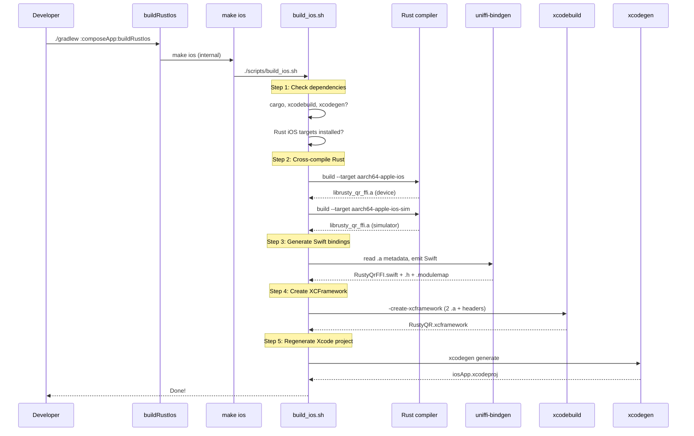
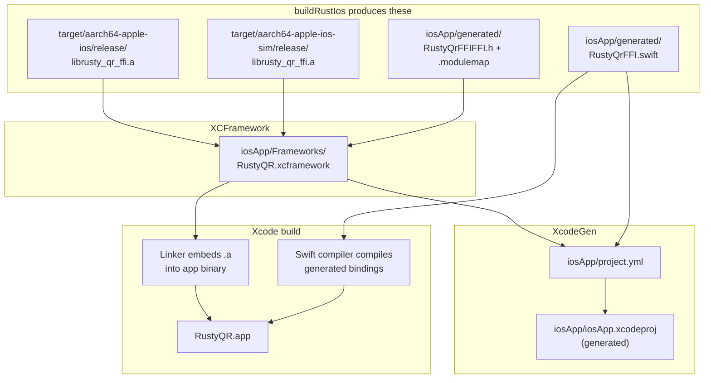
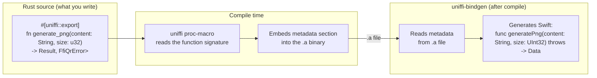

# iOS Build: From Rust to Xcode

This document explains how the Rust QR library gets compiled, wrapped in Swift bindings, packaged into an XCFramework, and wired into the iOS app via XcodeGen. If you've never worked with XCFrameworks, XcodeGen, or native bindings before, start here.

---

## What Problem Does This Solve?

The QR code logic is written in **Rust**, but the iOS app is written in **Swift**. Swift can't call Rust directly — they're different languages. We need three things:

1. **Compiled Rust libraries** (`.a` static archives) for both device and simulator
2. **An XCFramework** that bundles both `.a` files so Xcode can pick the right one automatically
3. **Generated Swift code** that knows how to call the functions inside the Rust library

The build pipeline automates all three steps.

---

## Building the App

```bash
# Compile Rust + generate Swift bindings + create XCFramework + regenerate Xcode project
./gradlew :composeApp:buildRustIos

# Open in Xcode and run
open iosApp/iosApp.xcodeproj
```

### When do I need to rebuild Rust?

Only when you change Rust code in `rustySDK/`. If you're only editing Swift or UI, skip `buildRustIos` — just open Xcode and build normally. The XCFramework and Swift bindings are already in place from the last Rust build.

Everything below explains what happens inside these commands.

---

## What is XcodeGen?

**XcodeGen** is a command-line tool that generates `.xcodeproj` files from a human-readable YAML file called `project.yml`.

### Why use it?

Xcode stores project configuration in `.pbxproj` files — opaque, auto-generated XML with random UUIDs on every line. These files are impossible to review in pull requests and cause constant merge conflicts when two developers add files simultaneously.

`project.yml` is the opposite: a clean, declarative YAML file where every setting is readable and diffs are meaningful. The `.xcodeproj` becomes a **generated artifact** — like a compiled binary, you never edit it by hand.

### Key rules

- **`project.yml` is the source of truth** — all project changes go here
- **Never edit `.xcodeproj` directly** — your changes will be overwritten on the next generation
- **`.xcodeproj` is gitignored** — it's regenerated from `project.yml` on every build

### How to regenerate

```bash
./gradlew :composeApp:generateXcodeProject
```

### When to regenerate

- After editing `project.yml`
- After running `./gradlew :composeApp:cleanBuildIos` (which deletes then regenerates the `.xcodeproj`)
- On a fresh clone (the `.xcodeproj` is not checked in)
- After running `./gradlew :composeApp:buildRustIos` (the build script regenerates it automatically)

### Common project.yml operations

**Adding a new Swift file:** Just create it in the `iosApp/` directory. XcodeGen auto-discovers source files via the `sources` path — no project file edit needed.

**Adding a framework dependency:**
```yaml
dependencies:
  - framework: Frameworks/SomeFramework.xcframework
    embed: false
```

**Adding a build setting:**
```yaml
settings:
  base:
    MY_SETTING: "value"
```

**Adding a build phase script:**
```yaml
preBuildScripts:
  - name: "My Script"
    script: |
      echo "Hello from build phase"
    basedOnDependencyAnalysis: false
```

**The `optional: true` pattern:** Generated artifacts (like Swift bindings or XCFrameworks) may not exist on a fresh clone before the first build. Marking them as `optional: true` lets XcodeGen generate a valid project even when these files are missing.

For the full XcodeGen spec, see: https://github.com/yonaskolb/XcodeGen/blob/master/Docs/ProjectSpec.md

---

## What Happens Inside `buildRustIos`

`buildRustIos` calls `rustySDK/scripts/build_ios.sh` under the hood, which does five things in order:

### 1. Check dependencies

The script verifies your machine has everything installed before doing any work. If anything is missing, it tells you exactly what to install:

```
ERROR: Missing dependencies:
  - xcodegen (run: brew install xcodegen)
  - Rust target aarch64-apple-ios (run: rustup target add aarch64-apple-ios)
```

### 2. Cross-compile Rust for iOS

The Rust compiler normally produces binaries for your Mac. To produce binaries that run on iPhones (or the iOS Simulator), we need a **cross-compiler** — it runs on your Mac but outputs ARM code that iOS understands.

The script invokes `cargo build` twice, once per target:

| Target | Who uses it | Output file |
|--------|------------|-------------|
| `aarch64-apple-ios` | Physical iPhones and iPads | `librusty_qr_ffi.a` |
| `aarch64-apple-ios-sim` | iOS Simulator on Apple Silicon Macs | `librusty_qr_ffi.a` |

The `.a` files (static archives) are native libraries — the iOS equivalent of Android's `.so` files. "Static" means the library code is copied directly into the app binary at link time, unlike dynamic libraries which are loaded at runtime.

### 3. Generate Swift bindings

The `.a` file contains Rust functions, but Swift doesn't know their names, parameter types, or return types. **UniFFI** solves this by reading metadata embedded in the `.a` and generating a Swift file that wraps every Rust function in a Swift-friendly API:

```
Rust function:  generate_png(content: &str, size: u32) -> Result<Vec<u8>, QrError>
                              ↓ uniffi-bindgen generates ↓
Swift function: func generatePng(content: String, size: UInt32) throws -> Data
                (throws FfiQrError on error)
```

Three files are generated in `iosApp/generated/`:
- `RustyQrFFI.swift` — the Swift wrapper code
- `RustyQrFFIFFI.h` — C header for the FFI functions
- `RustyQrFFIFFI.modulemap` — tells Swift how to import the C module

### 4. Create XCFramework

An **XCFramework** is Apple's standard packaging format for distributing compiled libraries that support multiple platforms. It bundles the device `.a` and the simulator `.a` into a single directory structure:

```
Frameworks/RustyQR.xcframework/
├── Info.plist
├── ios-arm64/                   ← device slice
│   └── librusty_qr_ffi.a
└── ios-arm64-simulator/         ← simulator slice
    └── librusty_qr_ffi.a
```

When you build the app in Xcode, it automatically picks the right slice — device `.a` for a real iPhone, simulator `.a` for the simulator. You never have to think about which one to use.

The script also prepares a `headers/` directory with the C header and module map, which get embedded into the XCFramework so Xcode can resolve the module imports.

### 5. Regenerate Xcode project

Finally, the script runs `xcodegen generate` to regenerate `.xcodeproj` from `project.yml`. This ensures the Xcode project picks up the newly created XCFramework and generated Swift sources.

---

## The Full Pipeline



---

## Artifact Flow



---

## How Xcode Picks Up the Artifacts

Three things connect the Rust build outputs to the Xcode build:

1. **XCFramework linked via `project.yml` dependencies** — the `Frameworks/RustyQR.xcframework` entry tells Xcode to link the static library into the app binary. Xcode automatically selects the correct slice (device or simulator) based on the build destination.

2. **Generated Swift via `project.yml` sources** — the `generated/` directory is listed as a source group. XcodeGen adds any `.swift` files it finds there to the compile sources.

3. **Module map via `SWIFT_IMPORT_PATHS`** — the build setting `SWIFT_IMPORT_PATHS = $(PROJECT_DIR)/generated` tells the Swift compiler where to find `.modulemap` files. This lets `RustyQrFFI.swift` do `import RustyQrFFIFFI` to access the C functions.

---

## How UniFFI Metadata Works

You might wonder: how does `uniffi-bindgen` know what Swift code to generate?

The answer is **proc-macros** — Rust compile-time code generators. When the Rust FFI crate is compiled, annotations like `#[uniffi::export]` expand into metadata that gets embedded directly into the `.a` binary:



This means the generated Swift is always in sync with the Rust code — if you change a function signature in Rust, re-running `./gradlew :composeApp:buildRustIos` regenerates the Swift to match.

---

## Why Two `.a` Files but One `.swift` File?

**Two `.a` files** because each platform needs its own machine code. ARM64 code compiled for the iOS device SDK can't run on the simulator SDK (different system libraries and ABI), even though both are ARM64.

**One `.swift` file** because the Swift code is platform-independent — it calls Rust functions by name through the C FFI, and the linker resolves those names against whichever `.a` was selected from the XCFramework. The UniFFI metadata in both `.a` files is identical (same function names, same types), so either one can be used as the source for code generation.

---

## First-Time Setup

```bash
# 1. Install Rust
curl --proto '=https' --tlsv1.2 -sSf https://sh.rustup.rs | sh

# 2. Add iOS cross-compilation targets
rustup target add aarch64-apple-ios aarch64-apple-ios-sim

# 3. Install XcodeGen
brew install xcodegen

# 4. Build everything (compiles Rust + generates bindings + creates XCFramework + generates .xcodeproj)
./gradlew :composeApp:buildRustIos

# Open in Xcode and run
open iosApp/iosApp.xcodeproj
```

---

## Cleaning Up

```bash
# Clean all Rust + iOS artifacts, then rebuild from scratch
./gradlew :composeApp:cleanBuildIos
```

This cleans and rebuilds:
- `rustySDK/target/` — all Rust compiled objects
- `iosApp/generated/` — the Swift bindings, C header, and module map
- `iosApp/Frameworks/` — the XCFramework
- `iosApp/iosApp.xcodeproj/` — the generated Xcode project (regenerated automatically)

If you only need to regenerate the Xcode project without rebuilding Rust:

```bash
./gradlew :composeApp:generateXcodeProject
```
