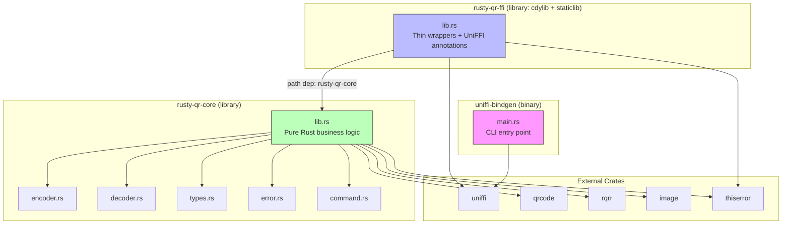
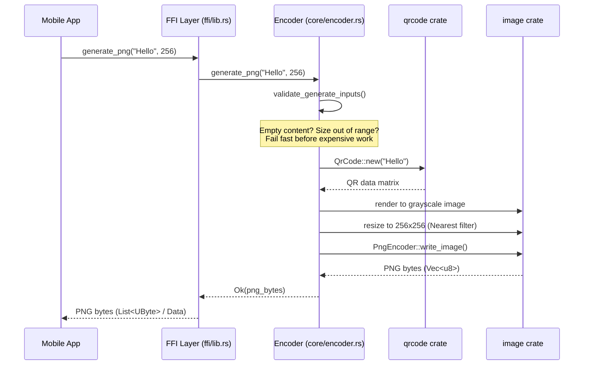
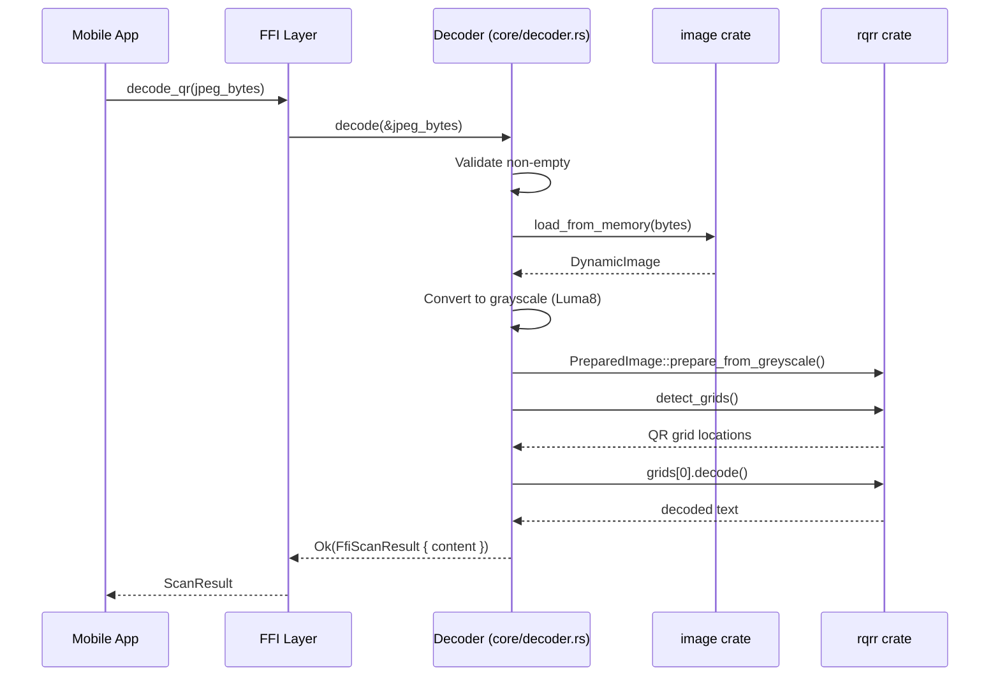
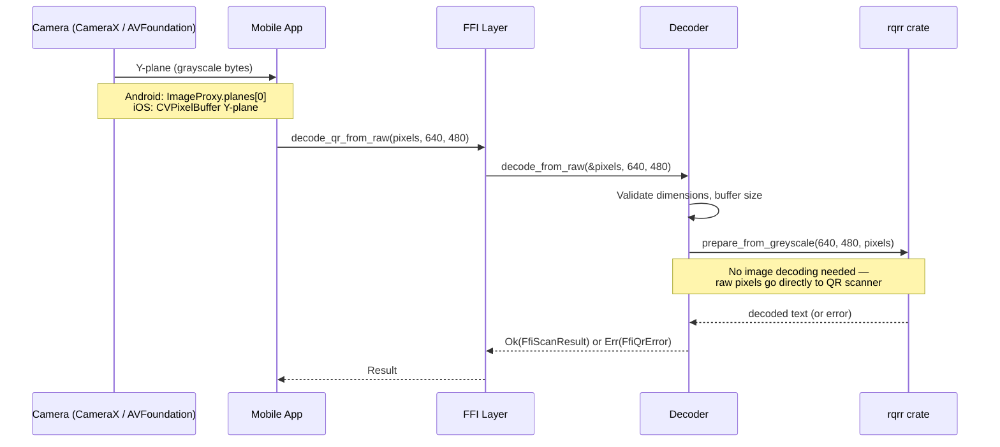
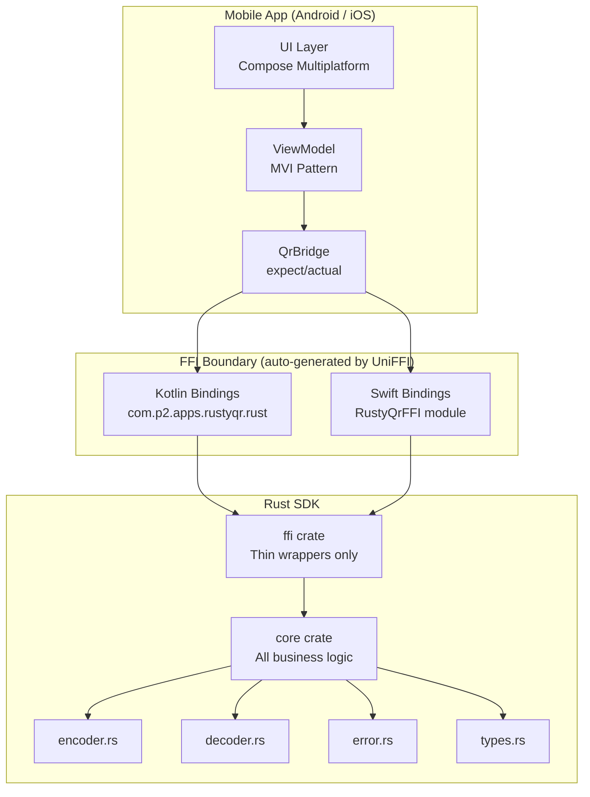
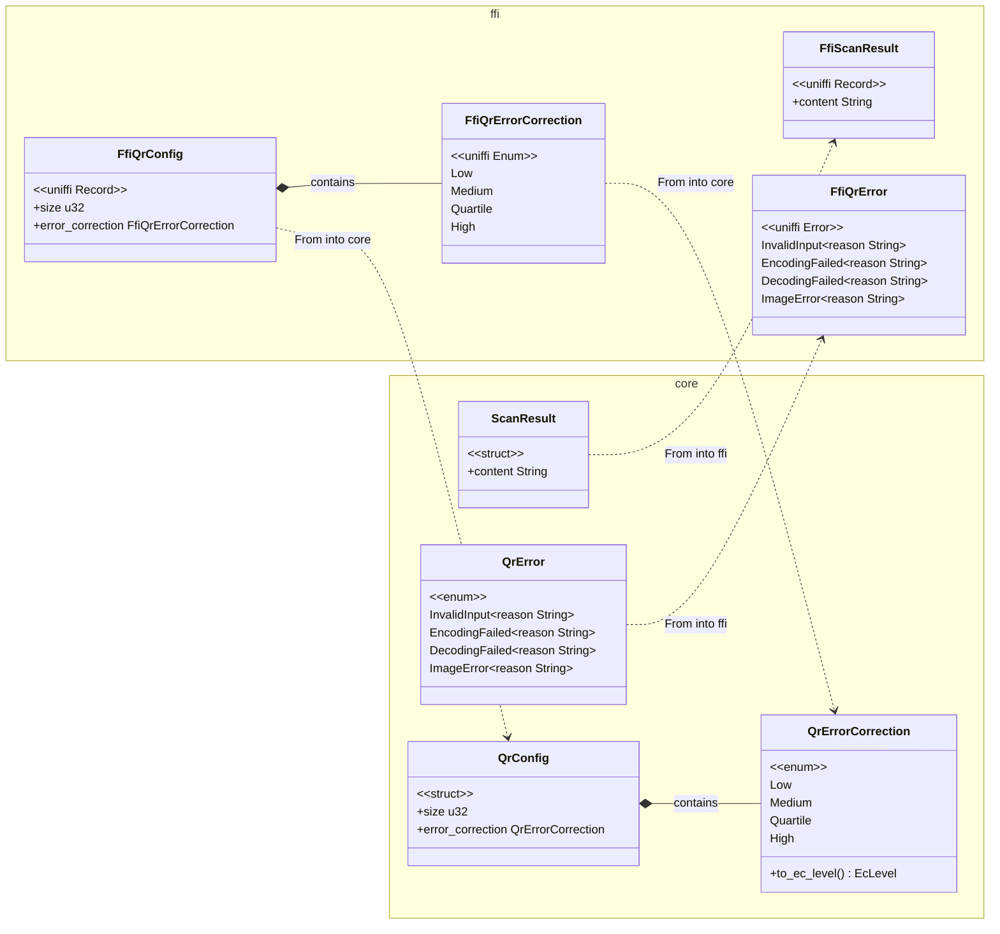
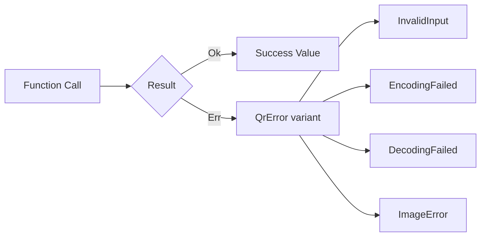
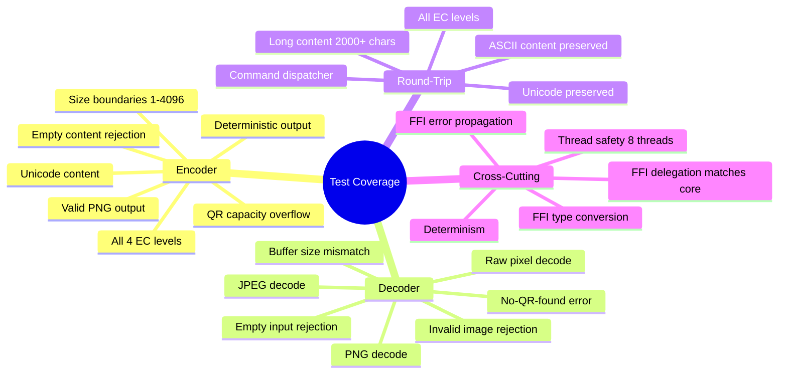

# Rusty-QR SDK

A QR code generation and scanning library written in Rust, designed to be called from Android (
Kotlin) and iOS (Swift) via auto-generated bindings. One codebase, two platforms, zero manual
bridging code.

---

## Table of Contents

- [Why Rust?](#why-rust)
- [What Does This SDK Do?](#what-does-this-sdk-do)
- [Project Structure](#project-structure)
- [Key Rust Concepts Used](#key-rust-concepts-used)
- [Understanding Cargo](#understanding-cargo)
- [How the Code Flows](#how-the-code-flows)
- [The FFI Boundary](#the-ffi-boundary)
- [Error Handling](#error-handling)
- [Testing](#testing)
- [Performance](#performance)
- [Commands Reference](#commands-reference)
- [Supply Chain Security](#supply-chain-security)
- [Glossary](#glossary)

---

## Why Rust?

If you're coming from Kotlin or Swift, you might wonder: **why write a mobile library in Rust?**

### The Problem

Mobile teams building cross-platform features face a recurring challenge: writing the same logic
twice (once in Kotlin, once in Swift). This leads to:

- **Logic drift** — subtle differences in how each platform implements the same algorithm
- **Double the bugs** — two codebases means two places for bugs to hide
- **Double the maintenance** — every feature change requires coordinated updates

### Why Not C/C++?

C and C++ are the traditional choice for shared native libraries. But they bring their own problems:

- **Memory unsafety** — buffer overflows, use-after-free, double-free bugs are common and can crash
  your app or create security vulnerabilities
- **Manual memory management** — you must `malloc` and `free` everything yourself, with no compiler
  help
- **Manual bridging** — writing JNI (Java Native Interface) code for Android and C bridging headers
  for iOS is tedious and error-prone

### What Rust Brings

Rust eliminates these problems through its **ownership system** — a set of rules enforced at compile
time that guarantee:

| Guarantee                  | What it means                                                       | Why it matters for mobile                                                  |
|----------------------------|---------------------------------------------------------------------|----------------------------------------------------------------------------|
| **Memory safety**          | No dangling pointers, no buffer overflows, no use-after-free        | Zero memory-related crashes in the shared library                          |
| **No garbage collector**   | Memory is freed deterministically when values go out of scope       | Predictable performance — no GC pauses during QR scanning                  |
| **Thread safety**          | The compiler rejects code with data races at compile time           | Safe to call from any thread (UI thread, camera thread, background thread) |
| **Zero-cost abstractions** | High-level code compiles to the same machine code as hand-written C | Native performance without sacrificing code clarity                        |

### The UniFFI Advantage

Mozilla's [UniFFI](https://mozilla.github.io/uniffi-rs/) tool automatically generates idiomatic
Kotlin and Swift bindings from Rust code. Instead of writing JNI boilerplate or C bridging headers
manually, you annotate your Rust functions with `#[uniffi::export]` and UniFFI generates:

- **Kotlin** data classes, sealed exceptions, and functions that feel native to Android developers
- **Swift** structs, enums, and functions that feel native to iOS developers

The generated code handles all the type marshaling (converting between Rust types and platform
types) automatically.

---

## What Does This SDK Do?

The SDK provides five operations:

| Function               | Input                          | Output         | Use Case                                                     |
|------------------------|--------------------------------|----------------|--------------------------------------------------------------|
| `generate_png`         | text + size                    | PNG bytes      | Generate a QR code image to display in your app              |
| `generate_with_config` | text + config (size, EC level) | PNG bytes      | Generate with custom error correction                        |
| `decode_qr`            | PNG/JPEG bytes                 | decoded text   | Decode a QR code from a saved image                          |
| `decode_qr_from_raw`   | grayscale pixels + dimensions  | decoded text   | Decode from a live camera frame (no image encoding overhead) |
| `get_library_version`  | —                              | version string | Runtime version check                                        |

Every function is **stateless** and **pure** — same input always produces the same output, with no
side effects. This makes the library trivially thread-safe and easy to reason about.

---

## Project Structure

```
rustSDK/
├── Cargo.toml                 # Workspace definition (lists all crates)
├── Cargo.lock                 # Exact dependency versions (committed to git)
├── deny.toml                  # Supply chain audit config
├── BENCHMARKS.md              # Performance measurements vs targets
│
├── crates/
│   ├── core/                  # ALL business logic lives here
│   │   ├── Cargo.toml         # Dependencies: qrcode, image, rqrr, thiserror
│   │   ├── src/
│   │   │   ├── lib.rs         # Public API: re-exports modules
│   │   │   ├── encoder.rs     # QR generation (text -> PNG bytes)
│   │   │   ├── decoder.rs     # QR scanning (image bytes -> text)
│   │   │   ├── types.rs       # Shared types: QrConfig, ScanResult, QrErrorCorrection
│   │   │   ├── error.rs       # QrError enum (4 variants)
│   │   │   └── command.rs     # Command dispatcher (internal, for testing)
│   │   ├── tests/             # Integration tests
│   │   │   ├── round_trip.rs  # Encode -> decode preserves content
│   │   │   ├── determinism.rs # Same input -> identical output
│   │   │   ├── thread_safety.rs # Concurrent access from multiple threads
│   │   │   └── jpeg_decode.rs # JPEG decode path validation
│   │   └── benches/
│   │       └── qr_benchmarks.rs # Performance benchmarks (Criterion)
│   │
│   ├── ffi/                   # THIN wrapper — zero business logic
│   │   ├── Cargo.toml         # Dependencies: rusty-qr-core, uniffi, thiserror
│   │   ├── uniffi.toml        # Binding config (Kotlin package, Swift module)
│   │   └── src/
│   │       └── lib.rs         # UniFFI exports + wrapper types + From/Into conversions
│   │
│   └── uniffi-bindgen/        # CLI tool for generating Kotlin/Swift binding files
│       ├── Cargo.toml
│       └── src/
│           └── main.rs        # Calls uniffi::uniffi_bindgen_main()
```

### Why Three Crates?

The workspace contains three crates with a strict, layered dependency chain:



### How the Crates Talk to Each Other

The three crates form a pipeline — each has a single responsibility and a clear communication path:

**1. `core` (lib.rs) — the engine, knows nothing about FFI**

`core` exposes public modules via `pub mod` and re-exports key types at the crate root. Any Rust
code that lists `rusty-qr-core` as a dependency can call it directly:

```rust
// core/src/lib.rs
pub mod encoder;
pub mod decoder;
pub mod types;
pub mod error;

pub use error::QrError;
pub use types::{QrConfig, QrErrorCorrection, ScanResult};
```

`core` depends only on pure Rust crates (`qrcode`, `rqrr`, `image`, `thiserror`). It has **zero
knowledge of UniFFI, Kotlin, or Swift** — you can compile and test it on any platform (Linux, macOS,
Windows, even WASM).

**2. `ffi` (lib.rs) — the translator, bridges core to mobile platforms**

`ffi/Cargo.toml` declares a **path dependency** on core:

```toml
[dependencies]
rusty-qr-core = { path = "../core" }
```

Cargo resolves this at build time within the workspace. `ffi/src/lib.rs` then does three things:

1. **Mirrors core types** with UniFFI annotations (`FfiQrConfig`, `FfiQrError`, etc.)
2. **Implements `From` conversions** in both directions (FFI types ↔ core types)
3. **Exports thin wrapper functions** — each is a one-liner delegating to core:

```rust
#[uniffi::export]
fn generate_png(content: String, size: u32) -> Result<Vec<u8>, FfiQrError> {
    rusty_qr_core::encoder::generate_png(&content, size).map_err(FfiQrError::from)
}
```

The call chain: Kotlin/Swift → generated binding → `ffi::generate_png` → `rusty_qr_core::encoder::generate_png`.
Data flows in as FFI wrapper types, gets converted to core types via `From`/`.into()`, processed by
core, then results are converted back to FFI types for the return trip.

**3. `uniffi-bindgen` (main.rs) — the code generator, runs at build time only**

This crate is a **binary** (not a library). It does NOT depend on `ffi` or `core` at compile time.
Instead, at build time you:

1. Compile `ffi` → produces `librusty_qr_ffi.dylib` (with UniFFI metadata baked in by proc macros)
2. Run `uniffi-bindgen` pointed at that `.dylib` → reads the embedded metadata → emits `.kt` and
   `.swift` source files

```bash
cargo run -p uniffi-bindgen generate \
    --library target/release/librusty_qr_ffi.dylib \
    --language kotlin --language swift \
    --out-dir generated/
```

### The Full Pipeline

```
core (pure Rust logic)
  ↓  path dependency
ffi (adds UniFFI annotations, mirrors types, delegates calls)
  ↓  cargo build produces librusty_qr_ffi.dylib/.a
uniffi-bindgen (reads .dylib metadata → emits .kt + .swift files)
  ↓
Kotlin/Swift call generated bindings → cross FFI boundary → ffi wrapper → core
```

### Why This Separation?

This is the **Open/Closed Principle** applied at the crate level: `core` is closed for modification
but open for extension. Want to add Python bindings? Add a new crate that depends on `core` — `core`
never changes. If UniFFI releases a breaking change, only `ffi` needs updating. The engine stays
untouched.

---

## Key Rust Concepts Used

### Ownership and Borrowing

Rust's most distinctive feature. Every value in Rust has exactly one **owner**. When the owner goes
out of scope, the value is automatically freed — no garbage collector needed.

**Borrowing** lets you temporarily access a value without taking ownership:

```rust
// `content` is borrowed as &str (a reference) — the caller keeps ownership
pub fn generate_png(content: &str, size: u32) -> Result<Vec<u8>, QrError> {
    // content is read here but not consumed
    // When this function returns, the caller still owns the original string
}
```

In the FFI layer, UniFFI converts owned `String` values (from Kotlin/Swift) into borrowed `&str`
references for Rust. This avoids unnecessary copies.

### Result and the `?` Operator

Rust has no exceptions. Instead, functions that can fail return `Result<T, E>` — a type that is
either `Ok(value)` or `Err(error)`:

```rust
// This function returns either a Vec<u8> (success) or a QrError (failure)
pub fn generate_png(content: &str, size: u32) -> Result<Vec<u8>, QrError> {
    validate_generate_inputs(content, size)?;  // ? = return early if Err
    let code = qrcode::QrCode::new(content.as_bytes())
        .map_err(|e| QrError::EncodingFailed { reason: e.to_string() })?;
    render_qr_to_png(&code, size)
}
```

The `?` operator is syntactic sugar: if the expression is `Err`, the function immediately returns
that error. If it's `Ok`, it unwraps the value and continues. This replaces try/catch with
compile-time guarantees that every error is handled.

### Enums with Data (Algebraic Data Types)

Rust enums can carry data in each variant — similar to Kotlin sealed classes or Swift enums with
associated values:

```rust
pub enum QrError {
    InvalidInput { reason: String },     // caller's fault
    EncodingFailed { reason: String },   // QR encoding library error
    DecodingFailed { reason: String },   // no QR code found
    ImageError { reason: String },       // PNG/JPEG processing error
}
```

UniFFI maps this to:

- **Kotlin**: `sealed class FfiQrException` with subclasses (`InvalidInput`, `EncodingFailed`, etc.)
- **Swift**: `enum FfiQrError` with associated values

### Traits and Derive Macros

Traits are Rust's equivalent of interfaces. **Derive macros** automatically implement traits:

```rust
#[derive(Debug, Clone, PartialEq, Eq)]  // compiler generates these implementations
#[must_use]                              // warns if the value is ignored
pub struct ScanResult {
    pub content: String,
}
```

| Derive             | What it does                               | Kotlin equivalent      |
|--------------------|--------------------------------------------|------------------------|
| `Debug`            | Enables `{:?}` formatting for logging      | `toString()`           |
| `Clone`            | Enables `.clone()` to create a copy        | `copy()` on data class |
| `PartialEq`        | Enables `==` comparison                    | `equals()`             |
| `thiserror::Error` | Auto-generates `Display` and `Error` impls | —                      |
| `uniffi::Record`   | Makes the type visible across FFI          | —                      |

### Modules and Visibility

Rust organises code into **modules**. By default, everything is private. You explicitly mark items
as `pub` (public):

```rust
// lib.rs — the crate root, defines what's publicly accessible
pub mod encoder;   // makes the encoder module public
pub mod decoder;
pub mod error;
pub mod types;

pub use error::QrError;  // re-exports QrError at the crate root
```

This gives precise control over what consumers can access — the public API is a deliberate, curated
surface.

### Feature Flags

Dependencies can be pulled in with only the features you need, reducing binary size:

```toml
# Instead of pulling in ALL of the image crate (formats, filters, etc.)...
image = "0.25"

# ...we pull in only PNG and JPEG support:
image = { version = "0.25", default-features = false, features = ["png", "jpeg"] }
```

This is critical for mobile — every kilobyte matters in your APK/IPA.

---

## Understanding Cargo

**Cargo** is Rust's build tool and package manager — think Gradle (Android) or SPM (iOS), but for
Rust.

### Key Files

| File         | Purpose                                       | Analogy                                |
|--------------|-----------------------------------------------|----------------------------------------|
| `Cargo.toml` | Project configuration, dependencies, metadata | `build.gradle.kts` / `Package.swift`   |
| `Cargo.lock` | Exact resolved dependency versions            | `gradle.lockfile` / `Package.resolved` |
| `deny.toml`  | Supply chain security policy                  | `dependencyCheck` plugin config        |

### Workspaces

A **workspace** is a collection of related crates (packages) that share a single `Cargo.lock` and
build output directory. Our workspace has three members:

```toml
# rustSDK/Cargo.toml
[workspace]
members = ["crates/core", "crates/ffi", "crates/uniffi-bindgen"]
resolver = "2"
```

This is similar to a Gradle multi-module project. Each crate has its own `Cargo.toml` defining its
dependencies.

### Crate Types

The FFI crate builds as two different library types:

```toml
[lib]
crate-type = ["cdylib", "staticlib"]
```

| Type        | Output                                    | Used by                                            |
|-------------|-------------------------------------------|----------------------------------------------------|
| `cdylib`    | `.so` (Linux/Android) or `.dylib` (macOS) | Android loads this via JNA at runtime              |
| `staticlib` | `.a` (static archive)                     | iOS links this into the app binary at compile time |

---

## How the Code Flows

### QR Generation



### QR Decoding (Saved Image)



### QR Decoding (Live Camera Frame)

This is the **performance-critical path** — called on every camera frame during live scanning:



The key optimisation: `decode_qr_from_raw` skips the image decode step entirely. Camera APIs provide
raw grayscale pixels, and `rqrr` accepts raw grayscale pixels — no PNG/JPEG encoding/decoding in
between.

### End-to-End Architecture



---

## The FFI Boundary

The FFI (Foreign Function Interface) layer is the bridge between Rust and mobile platforms. Here's
how types cross the boundary:

### Type Mapping

| Rust (core)         | Rust (ffi wrapper)     | Kotlin (generated)                  | Swift (generated)             |
|---------------------|------------------------|-------------------------------------|-------------------------------|
| `QrErrorCorrection` | `FfiQrErrorCorrection` | `FfiQrErrorCorrection` (enum class) | `FfiQrErrorCorrection` (enum) |
| `QrConfig`          | `FfiQrConfig`          | `FfiQrConfig` (data class)          | `FfiQrConfig` (struct)        |
| `ScanResult`        | `FfiScanResult`        | `FfiScanResult` (data class)        | `FfiScanResult` (struct)      |
| `QrError`           | `FfiQrError`           | `FfiQrException` (sealed class)     | `FfiQrError` (enum)           |
| `Vec<u8>`           | `Vec<u8>`              | `List<UByte>`                       | `Data`                        |
| `String`            | `String`               | `String`                            | `String`                      |
| `u32`               | `u32`                  | `UInt`                              | `UInt32`                      |

### Why Wrapper Types?

The core crate has no UniFFI dependency — this is a deliberate design choice. So the FFI crate
defines its own wrapper types that mirror the core types but add UniFFI derives:

```rust
// Core type (no UniFFI dependency)
#[derive(Debug, Clone)]
pub struct QrConfig { pub size: u32, pub error_correction: QrErrorCorrection }

// FFI wrapper (adds UniFFI derive)
#[derive(Debug, Clone, uniffi::Record)]
pub struct FfiQrConfig { pub size: u32, pub error_correction: FfiQrErrorCorrection }

// Conversion between them
impl From<FfiQrConfig> for rusty_qr_core::QrConfig { ... }
```

### Class Relationship Diagram



The `From` conversion direction follows the data flow: inputs (config, error correction) convert
**from FFI → core**, while outputs (scan results, errors) convert **from core → FFI**.

### One-Liner Delegation

Every FFI function is a single line that calls into core:

```rust
#[uniffi::export]
fn generate_png(content: String, size: u32) -> Result<Vec<u8>, FfiQrError> {
    rusty_qr_core::encoder::generate_png(&content, size).map_err(FfiQrError::from)
}
```

This rule is enforced by convention: **if you're writing an `if` statement in the FFI crate, it
belongs in core.**

---

## Error Handling

### No Exceptions, No Panics

Rust has no exceptions. Instead, every function that can fail returns `Result<T, QrError>`:



The library guarantees **zero panics** in production code. A panic in Rust is equivalent to an
unhandled exception — it would crash the mobile app. Every error is caught and returned as a typed
`QrError` variant.

### Error Variants

| Variant          | When it occurs                                          | Caller action                              |
|------------------|---------------------------------------------------------|--------------------------------------------|
| `InvalidInput`   | Empty content, size = 0, size > 4096, empty image bytes | Fix the input — never retry                |
| `EncodingFailed` | Content exceeds QR capacity                             | Try shorter content or lower EC level      |
| `DecodingFailed` | No QR code found in image                               | Expected — not all images contain QR codes |
| `ImageError`     | PNG/JPEG parsing failed, image encoding error           | Check the image format                     |

### Validation Pattern

All input validation happens **upfront**, before any expensive work:

```rust
fn validate_generate_inputs(content: &str, size: u32) -> Result<(), QrError> {
    if content.is_empty() {
        return Err(QrError::InvalidInput {
            reason: "content must not be empty".into(),
        });
    }
    if size == 0 || size > MAX_SIZE {
        return Err(QrError::InvalidInput {
            reason: format!("size must be 1..={MAX_SIZE}, got {size}"),
        });
    }
    Ok(())
}
```

---

## Testing

The SDK has **56 tests** organised into four tiers:

### Test Tiers

| Tier              | Location                | Count | What it validates                              |
|-------------------|-------------------------|-------|------------------------------------------------|
| Unit tests        | `crates/core/src/*.rs`  | 30    | Individual functions in isolation              |
| Integration tests | `crates/core/tests/`    | 12    | Cross-module behaviour, round-trips            |
| FFI tests         | `crates/ffi/src/lib.rs` | 14    | Type conversion, delegation, error propagation |
| Benchmarks        | `crates/core/benches/`  | 8     | Performance against PRD targets                |

### What's Tested



---

## Performance

Measured on Apple Silicon via [Criterion](https://bheisler.github.io/criterion.rs/book/) (100
samples each):

| Operation                      | Time     | Target   | Status   |
|--------------------------------|----------|----------|----------|
| Generate 256px                 | ~1.1 ms  | < 10 ms  | PASS     |
| Generate 1024px                | ~9.9 ms  | < 50 ms  | PASS     |
| Decode PNG 256px               | ~2.3 ms  | < 20 ms  | PASS     |
| Decode PNG 1080px              | ~15.4 ms | < 100 ms | PASS     |
| Decode raw 256px (camera path) | ~2.2 ms  | < 20 ms  | PASS     |
| Full round-trip 256px          | ~3.4 ms  | —        | baseline |

All targets met with significant margin. See [BENCHMARKS.md](BENCHMARKS.md) for full details.

---

## Commands Reference

### Prerequisites

```bash
# Install Rust (if not already installed)
curl --proto '=https' --tlsv1.2 -sSf https://sh.rustup.rs | sh

# Install cargo-deny for supply chain auditing
cargo install cargo-deny
```

### Build

```bash
# Check that the code compiles (fast, doesn't produce binaries)
cargo check --workspace

# Build all crates (debug mode)
cargo build --workspace

# Build the FFI crate only (produces .dylib/.so and .a)
cargo build -p rusty-qr-ffi

# Build in release mode (optimised, smaller binary)
cargo build -p rusty-qr-ffi --release
```

### Test

```bash
# Run all tests across all crates
cargo test --workspace

# Run tests for a specific crate
cargo test -p rusty-qr-core
cargo test -p rusty-qr-ffi

# Run a specific test by name
cargo test round_trip_preserves_content

# Run tests with output visible (normally suppressed on success)
cargo test --workspace -- --nocapture
```

### Lint

```bash
# Check formatting (does not modify files)
cargo fmt --check

# Auto-fix formatting
cargo fmt

# Run Clippy (Rust's linter) — all warnings treated as errors
cargo clippy --workspace -- -D warnings
```

### Benchmark

```bash
# Run all benchmarks (takes ~2 minutes)
cargo bench -p rusty-qr-core

# Run a specific benchmark
cargo bench -p rusty-qr-core -- generate_png_256px

# Quick benchmark run (fewer samples, faster)
cargo bench -p rusty-qr-core -- --quick
```

Benchmark results are saved to `target/criterion/` with HTML reports you can open in a browser.

### Generate Bindings

```bash
# Build the FFI crate first
cargo build -p rusty-qr-ffi

# Generate Kotlin bindings
cargo run -p uniffi-bindgen generate \
  --library target/debug/librusty_qr_ffi.dylib \
  --language kotlin \
  --out-dir /tmp/kotlin-bindings

# Generate Swift bindings
cargo run -p uniffi-bindgen generate \
  --library target/debug/librusty_qr_ffi.dylib \
  --language swift \
  --out-dir /tmp/swift-bindings
```

### Security Audit

```bash
# Run supply chain checks (licenses, advisories, duplicate crates)
cargo deny check
```

### Full CI Check (run all of these before committing)

```bash
cargo fmt --check && \
cargo clippy --workspace -- -D warnings && \
cargo test --workspace && \
cargo deny check
```

---

## Supply Chain Security

The project uses [`cargo-deny`](https://embarkstudios.github.io/cargo-deny/) to audit dependencies.
The configuration in `deny.toml` enforces:

| Check          | Policy                                                                               |
|----------------|--------------------------------------------------------------------------------------|
| **Advisories** | All dependencies checked against [RustSec Advisory Database](https://rustsec.org/)   |
| **Licenses**   | Only permissive licenses allowed (MIT, Apache-2.0, MPL-2.0, BSD, ISC, Zlib, Unicode) |
| **Sources**    | Only crates.io allowed — no unknown registries or git dependencies                   |
| **Bans**       | Duplicate crate versions produce warnings                                            |

---

## Glossary

| Term                | Definition                                                                                       |
|---------------------|--------------------------------------------------------------------------------------------------|
| **Cargo**           | Rust's build tool and package manager (like Gradle or SPM)                                       |
| **Crate**           | A Rust package — either a library or a binary (like a Gradle module)                             |
| **Workspace**       | A collection of related crates sharing a build directory and lockfile                            |
| **`Cargo.toml`**    | A crate's manifest file — declares name, version, and dependencies                               |
| **`Cargo.lock`**    | Records exact resolved dependency versions (committed to git for libraries)                      |
| **Ownership**       | Rust's memory model — every value has exactly one owner; freed when owner goes out of scope      |
| **Borrowing (`&`)** | Temporary read access to a value without taking ownership                                        |
| **`Result<T, E>`**  | A type that is either `Ok(T)` (success) or `Err(E)` (failure) — Rust's alternative to exceptions |
| **`?` operator**    | Syntactic sugar: return early if `Err`, unwrap if `Ok`                                           |
| **`Vec<u8>`**       | A growable byte array (like `ByteArray` in Kotlin or `Data` in Swift)                            |
| **`&str`**          | A borrowed string slice — a reference to string data without owning it                           |
| **`String`**        | An owned, heap-allocated string (like `String` in Kotlin/Swift)                                  |
| **Trait**           | An interface that types can implement (like Kotlin `interface` or Swift `protocol`)              |
| **Derive macro**    | Auto-generates trait implementations at compile time (`#[derive(Debug, Clone)]`)                 |
| **`#[must_use]`**   | Compiler warning if a return value is ignored                                                    |
| **`thiserror`**     | A library for deriving `Error` trait implementations with custom messages                        |
| **UniFFI**          | Mozilla's tool for generating Kotlin/Swift bindings from Rust code                               |
| **`cdylib`**        | A C-compatible dynamic library (`.so` on Android, `.dylib` on macOS)                             |
| **`staticlib`**     | A static library (`.a`) linked into the binary at compile time (used by iOS)                     |
| **Clippy**          | Rust's official linter — catches common mistakes and suggests improvements                       |
| **Criterion**       | The standard Rust benchmarking framework (statistical, runs on stable Rust)                      |
| **`cargo-deny`**    | Supply chain auditing tool (licenses, security advisories, dependency hygiene)                   |
| **FFI**             | Foreign Function Interface — the mechanism for calling Rust from other languages                 |
| **Proc macro**      | A compile-time code generator (UniFFI uses these: `#[uniffi::export]`)                           |
| **Feature flag**    | Conditional compilation — pull in only the parts of a dependency you need                        |
